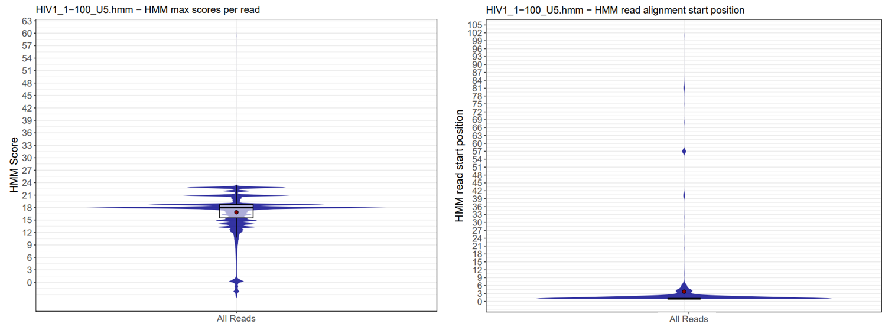

# Quick Start  
### Download the INSPIIRED Docker image.
```wget https://bushmanlab.org/export/inspiired2_latest.tar.gz```

### Load the image
```docker load -i inspiired2_latest.tar.gz```

### Process a small 50 site synthetic data set
```
docker run --rm -it --shm-size=5g inspiired2 bash
%> cd /opt/INSPIIRED2/tests/synTests/U5_50sites_seed1
%> ./run.sh
```

# Preparing your data for analysis 
Place your sequencing data, sample data file, and processing script (run.sh) in a directory, eg. /home/everett, and include the directory in the Docker call. 
Example run.sh script:

```
#!/bin/bash
set -euo pipefail

inspiired2 demultiplex --outputDir out             \
                       --sampleData sampleData.tsv \
                       --I1 I1.fastq.gz            \
                       --R1 R1.fastq.gz            \
                       --R2 R2.fastq.gz
inspiired2 prepReads         --outputDir out  --inputData out/demultiplex.rds
inspiired2 alignReads        --outputDir out  --inputData out/prepReads.rds
inspiired2 buildFragments    --outputDir out  --inputData out/alignReads.rds
inspiired2 buildStdFragments --outputDir out  --inputData out/buildFragments.rds
inspiired2 buildSites        --outputDir out  --inputData out/buildStdFragments.rds
inspiired2 nearestGenes      --outputDir out  --inputData out/buildSites.rds
inspiired2 annotateRepeats   --outputDir out  --inputData out/nearestGenes.rds
```

### Start processing in Docker

The pipeline reads intermediate results directly to memory. The maximum amount of allowed memory for this scratch space is defined within the Docker call ```--shm-size=10g```. Larger data sets may require the allocation of more memory. In the following Docker call, the -v flag is binding where your data is located on your server ```/home/everett``` to the directory ```/workspace``` within the Docker container. The -w flag tells Docker that reference file paths will be relative to /workspace within the container.

```docker run --rm --shm-size=10g -v /home/everett:/workspace -w /workspace inspiired2 bash run.sh```


### Setting up the sample configuration file

The [sample configuration file](sampleData.tsv) provides INSPIIRED2 information about sequencing library. Sequenced amplicons are expected to have the structure defined in the [2016 INSPIIRED paper](https://pubmed.ncbi.nlm.nih.gov/28344990). Reads originating from within LTR sequences and transverse genomic junctures are referred to as *anchor reads* because they anchor sequencing reads to integration positions. Reads originating from within ligated linkers at the opposite ends of fragments are referred to as *adrift reads* because their alignment positions drift due to the genome being sheared during library preparation. For each sample replicate, the sample configuration file will need the sequence of the adrift linker (eg. GTTAAAGGTGTTCCCTGCCGNNNNNNNNNNNNCTCCGCTTAAGGGACT) and I1 barcode (eg. ACCTAAGTCCGT).

<p align="center">
  
</p>

In addition to this sequence information, the sample configuration file needs information about the reference genome against which to align your data (refGenome), information about your vector (vectorFastaFile), information about how to recognize the ends of LTR sequences (leaderSeqHMM), and processing details (mode). Importantly, leaderSeqHMM is the name of a file stored within the pipeline's ```data/hmms``` folder. The software is provided with HMMs that recognize HIV-1 3' and 5' LTR sequences. Custom vector sequences and HMM profiles can be imported at run time using the prepReads module and --vectorDir and --hmmDir flags. The design of HMMs that match your vectors is discussed in the 'Working with HMMs' section below. 

# Working with HMMs
Anchor reads containing the ends of vector LTR sequences are recognized using vector specific HMMs. HMMs are used because them are particularly adept at recognizing mismatches and minor indels that can occur due to natural variation and sequencing error.  Vector HMMs are created with the HMMER software package for each vector used in your analysis. To create a vector HMM, first create a FASTA file for the expected vector sequence you expect to observe in your R2 read sequences. This will be the expected sequence observed before transitioning into genomic DNA, eg.
```
>mySeq
GAAAATCTCTAGCA
```

Next, use HMMER to create a HMM with this FASTA file.
```
%> hmmbuild mySeq.hmm mySeq.fasta
```
Now that we created an HMM, we need to determine how to score it. Next create a FASTA file containing minor variations in your sequence to see how it affects the HMM score. For example, here we create a file name *mySeqTests.fasta* and make minor changes which we would still consider valid hits.
``` 
>mySeq
GAAAATCTCTAGCA
>mySeq_1SNP
GAAGATCTCTAGCA
>mySeq_2SNPs
GAAGATCTCAAGCA
>mySeq_1del
GAAAATTCTAGCA
>mySeq_1del_1ins
GAAATCTCTGAGCA
```
Once we create a couple of minor variations in our target sequence, we evaluate the variations with our HMM.  
First run this command to evaluate the test sequences:

```
nhmmer --F1 1 --F2 1 --F3 1 -T -5 --incT -5 --nobias --popen 0.15 --pextend 0.05 --tblout mySeqTests.tbl mySeq.hmm mySeqTests.fasta
```

Next, review the output (mySeqTests.tbl) to determine a minimum acceptable score:
  
```
# target name        accession  query name           accession  hmmfrom hmm to alifrom  ali to envfrom  env to  sq len strand   E-value  score  bias  description of target
#------------------- ---------- -------------------- ---------- ------- ------- ------- ------- ------- ------- ------- ------ --------- ------ ----- ---------------------
mySeq                -          mySeq                -                1      14       1      14       1      14      14    +      0.0063    3.7   1.1  -
mySeq_1SNP           -          mySeq                -                1      14       1      14       1      14      14    +       0.016    2.8   0.3  -
mySeq_2SNPs          -          mySeq                -                1      13       1      13       1      14      14    +        0.15    0.5   0.9  -
mySeq_1del_1ins      -          mySeq                -                3      10       2       9       1      14      14    +        0.29   -0.1   0.2  -
mySeq_1del           -          mySeq                -                4      13       3      12       1      13      13    +        0.38   -0.4   1.2  -
```
  
Examine the HMM scores in column 14 (score) and make a decision about the lowest score that provides an acceptable match. In this example, we will go with 0.5. Next we will create an settings file for the new HMM. This file needs to have the same name as the HMM file except we replace ".hmm" with ".cfg". The settings file provides default scoring parameters for the HMM. Here is an example:
  
```
HMMminStartPos  1
HMMmaxStartPos  5
HMMminFullBitScore      10
HMMmaxFullBitScore      30
HMMmatchEnd     TRUE
HMMmatchTerminalSeq     CA
HMMmatchEndRadius       2
```

Alternatively, for each HMM defined in your sampelData.tsv file, you can provide these parameters as a comma delimited string where each HMM is separatred by a pipe character. HMM parameters provided on the command line will overide parameters found in the default  .cfg files.

```
inspiired2 prepReads --outputDir out --inputData out/demultiplex.rds --HMMparam 'HIV1_1-100_U5.hmm,1,5,10,30,TRUE,CA,2|HIV1_1-100_U3_RC.hmm,1,5,30,60,TRUE,CA,2'
```

The best approach for processing data with potentially varied LTR sequences is to run the HMMs on raw sequencing data using the testHMMs module:

```
inspiired2 testHMMs --outputDir out  --sampleData sampleData.tsv --anchorReads  Undetermined_S0_R2_001.fastq.gz --HMMmatchEnd --HMMmatchTerminalSeq CA --HMMmatchEndRadius 2
```
This module tests sequencing data using the HMM profiles found in the sample data file and provided a graphical output useful for tuning HMM paramaters:

<p align="center">
  
</p>


#Processing with databasing

To include databasing features in your processing, additional parameters need to be passed to Docker. Databasing is only available for the buildFragments module and is implimented by including the --dbConfigFile --dbConfigID flags. When databasing is used, fragment records are written both to the the output directory and to a data warehouse. The data warehouse includes two parts:
  1. A SQL database that holds sample data and a pointers to a local parquet file.
  2. A collection of parquet files containing fragment details.

In order for the files to be written to the data warehouse, this flag must be included in your Docker call:

```--user $(id -u):$(id -g)```

The path to your data warehouse must also be included:

```-v /media/md0/data/inspiired:/data ```

The final Docker call for a run including databasing would be:
  
```docker run --rm --shm-size=10g --user $(id -u):$(id -g) -v /media/md0/data/inspiired:/data -v /home/everett:/workspace -w /workspace inspiired2 bash run.sh```

#### Pulling data from the data warehouse

The pullDBrecords module retrieves fragment records based on trial, subject, and sample indentifiers. Rather than starting the pipeline with the typical calls to the demultiplex, prepReads, alignReads, and buildFragments modules, the pipeline can start with a the pullDBrecords module:

```
inspiired2 pullDBrecords     --outputDir out  --outputFile fragments.rds --dbConfigFile my.cnf --dbConfigID inspiired2 --dataPath  /media/md0/data/inspiired --trials Penn_CART --subjects "p432,p663,p215"
inspiired2 buildStdFragments --outputDir out  --inputData out/buildFragments.rds
inspiired2 buildSites        --outputDir out  --inputData out/buildStdFragments.rds
```
Specific fragment records can be pulled using the --trials,  --subjects, and --samples flags which accept comma delimited lists of identifiers. One or more trial identifier must be provided. The module will treat all other flags as 'all' unless identifiers are provided.

  


