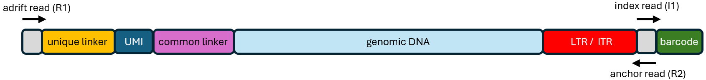

# INSPIIRED2

INSPIIRED2 identifies vector integration sites in reference genomes from paired-end Illumina short-read data. It is designed for linker-mediated libraries in which:

- The **anchor read** crosses the vector-genome junction. Vector-terminal sequence anchors the read to the expected vector end, while the remaining sequence identifies the genomic integration position.
- The **adrift read** begins at the ligated linker and reads into genomic DNA from the sonic-shearing boundary. Variation in this boundary provides the primary estimate of clonal abundance.

INSPIIRED2 demultiplexes and trims reads, recognizes vector-terminal sequence with a profile HMM, aligns both mates to a reference genome, constructs genomic fragments, standardizes fragment boundaries, filters likely PCR rearrangements, assembles sample-level integration sites, and adds gene and repeat annotations.

## Contents

- [System requirements](#system-requirements)
- [Quick start](#quick-start)
- [Preparing input data](#preparing-input-data)
- [Standard workflow](#standard-workflow)
- [General command behavior](#general-command-behavior)
- [Core pipeline modules](#core-pipeline-modules)
  - [`demultiplex`](#demultiplex)
  - [`prepReads`](#prepreads)
  - [`alignReads`](#alignreads)
  - [`buildFragments`](#buildfragments)
  - [`buildStdFragments`](#buildstdfragments)
  - [`buildSites`](#buildsites)
  - [`nearestGenes`](#nearestgenes)
  - [`annotateRepeats`](#annotaterepeats)
- [Supporting commands](#supporting-commands)
  - [`testHMMs`](#testhmms)
  - [`buildSeqDataMap`](#buildseqdatamap)
- [HMM configuration](#hmm-configuration)
- [Custom reference resources](#custom-reference-resources)
- [Optional fragment database](#optional-fragment-database)
  - [`testDBconn`](#testdbconn)
  - [`pullDBrecords`](#pulldbrecords)
- [Interpreting the final output](#interpreting-the-final-output)
- [Troubleshooting and parameter changes](#troubleshooting-and-parameter-changes)
- [Current command scope](#current-command-scope)
- [Citation](#citation)

## System requirements

The supplied Docker image is the recommended execution environment because INSPIIRED2 depends on R/Bioconductor packages and command-line tools including HMMER, BLAT, BLAST+, CD-HIT-EST, and UCSC sequence utilities.

INSPIIRED2 uses Linux multicore processing. CPU, memory, disk, and shared-memory requirements depend on library size, read complexity, and the reference genomes used. A server with approximately 30 cores and 100 GB RAM is a reasonable starting point for substantial datasets, but these are not hard minimums. On smaller systems, reduce `--threads` values; memory use generally increases with the number of concurrent workers.

Temporary files are written below `--ramDiskPath`, which defaults to the server's RAM disk `/dev/shm`. If that location is not writable, INSPIIRED2 uses the output directory. The Docker `--shm-size` setting controls the space available in `/dev/shm`.

## Quick start

Download and load the distributed Docker image:

```bash
wget https://bushmanlab.org/export/inspiired2_latest.tar.gz
docker load -i inspiired2_latest.tar.gz
```

Run the bundled synthetic test:

```bash
docker run --rm -it --shm-size=5g inspiired2 bash
cd /opt/INSPIIRED2/tests/synTests/U5_50sites_seed1
./run.sh
```

For a project in the current host directory, place the commands in a script such as [`run.sh`](run.sh):

```bash
docker run --rm --shm-size=20g \
  -v "$PWD":/workspace \
  -w /workspace \
  inspiired2 bash run.sh
```

Increase `--shm-size` for larger datasets. To make output files owned by the current host user, `--user "$(id -u):$(id -g)"` may be added. 

## Preparing input data

### Sequencing files

A standard run requires three synchronized FASTQ files:

1. Index 1 reads, typically `I1.fastq.gz`.
2. Adrift reads, typically `R1.fastq.gz`.
3. Anchor reads, typically `R2.fastq.gz`.

The files must contain the same read records in the same order. Standard Illumina FASTQ organization is expected. Do not independently sort, subset, or otherwise reorder one mate. Verify FASTQ synchronization before running. Compressed FASTQ input is supported.

### Sample-data file

[`sampleData.tsv`](sampleData.tsv) is a tab-delimited file with one row per sample replicate and these exact column names:

| Column | Description |
|---|---|
| `trial` | Study, experiment, or analysis-group identifier. |
| `subject` | Biological subject identifier. Integration positions are standardized across samples and replicates within each `trial`/`subject`. |
| `sample` | Sample or time-point identifier. Final site records are assembled at this level. |
| `replicate` | Technical-replicate identifier. Values must be integer-valued; consecutive positive integers beginning at `1` are strongly recommended. |
| `index1Seq` | Expected Index 1 barcode sequence. |
| `adriftReadLinkerSeq` | Complete linker sequence at the beginning of the adrift read, with the UMI represented by `N` characters. |
| `refGenome` | Reference identifier matching an installed `<refGenome>.2bit` file. |
| `leaderSeqHMM` | HMM filename, including `.hmm`, used to recognize the vector-terminal sequence in anchor reads. |
| `vectorFastaFile` | Vector FASTA filename used by the internal-vector read filter. |
| `mode` | Vector-end detection mode. Use exactly `U3` or `U5`. |

Example:

```text
trial	subject	sample	replicate	index1Seq	adriftReadLinkerSeq	refGenome	leaderSeqHMM	vectorFastaFile	mode
trial1	subject01	day0	1	CAGTGGGTCTAA	GAACGAGCACTAGTAAGCCCNNNNNNNNNNNNCTCCGCTTAAGGGACT	hg38	HIV1_1-100_U5.hmm	HXB2.fasta	U5
```

Every `adriftReadLinkerSeq` must contain one contiguous UMI region and match, case-insensitively:

```text
^[ACGT]{3,}N{5,}[ACGT]{3,}$
```

In other words, the linker must contain at least three fixed bases, at least five `N` characters, and at least three more fixed bases. The fixed sequences before and after the UMI are tested separately during demultiplexing.

Additional requirements:

- Resource names are case-sensitive and must match installed HMM, vector, and reference files.
- Barcodes and linkers should remain distinguishable after the configured mismatch allowances are applied.
- A subject identifier should refer to the same biological subject wherever longitudinal integration-site tracking is intended.

The expected library structure follows the [INSPIIRED method](https://pubmed.ncbi.nlm.nih.gov/28344990).

<p align="center">
  
</p>

## Standard workflow

The normal pipeline is a daisy chain: the primary RDS output of one module becomes the input to the next.

```bash
#!/usr/bin/env bash
set -euo pipefail

inspiired2 demultiplex --outputDir out --threads 30 \
  --sampleData sampleData.tsv \
  --indexReads I1.fastq.gz \
  --adriftReads R1.fastq.gz \
  --anchorReads R2.fastq.gz

inspiired2 prepReads         --outputDir out --threads 30 --inputData out/demultiplex.rds
inspiired2 alignReads        --outputDir out --threads 30 --inputData out/prepReads.rds
inspiired2 buildFragments    --outputDir out --threads 30 --inputData out/alignReads.rds
inspiired2 buildStdFragments --outputDir out --threads 30 --inputData out/buildFragments.rds
inspiired2 buildSites        --outputDir out --threads 30 --inputData out/buildStdFragments.rds
inspiired2 nearestGenes      --outputDir out --threads 30 --inputData out/buildSites.rds
inspiired2 annotateRepeats   --outputDir out --threads 30 --inputData out/nearestGenes.rds
```

The shell options stop the script at the first failed command.

| Module | Main role | Primary output |
|---|---|---|
| `demultiplex` | Quality-trim and assign reads using Index 1 and linker sequences | `demultiplex.rds` |
| `prepReads` | Recognize vector-terminal sequence and prepare genomic read segments | `prepReads.rds` |
| `alignReads` | Align anchor and adrift genomic sequences to reference genomes | `alignReads.rds` |
| `buildFragments` | Pair compatible mate alignments into candidate physical fragments | `buildFragments.rds` |
| `buildStdFragments` | Standardize boundaries, handle multi-hits, filter PCR artifacts, and collapse fragments | `buildStdFragments.rds` |
| `buildSites` | Assemble sample-level integration sites and calculate abundance | `buildSites.rds` |
| `nearestGenes` | Add gene, exon, and nearest-gene annotations | `nearestGenes.rds` |
| `annotateRepeats` | Add overlapping repeat names and classes | `annotateRepeats.rds` |

`testHMMs`, `buildSeqDataMap`, `testDBconn`, and `pullDBrecords` are supporting commands rather than required stages of the standard chain.

## General command behavior

Most core modules accept the following options:

| Flag | Default | Meaning |
|---|---:|---|
| `--outputDir` | Required | Output directory. It is normally created during module setup. When starting directly at `buildFragments` in v1.4.4, create the directory first. |
| `--inputData` | Required | RDS output from the preceding module. `demultiplex` uses raw input flags instead. |
| `--threads` | `50` | Maximum worker or library thread count.  |
| `--fileTag` | Module name | Basename for output files.  |
| `--ramDiskPath` | `/dev/shm` | Scratch filesystem; falls back to `outputDir` when not writable. |

The inspirred2 launcher supplies `--softwareRoot` internally. Users should not add it.

Boolean options such as `--disablePolyGfilter` are activated by including the flag alone; do not append `TRUE`. Quote any value containing spaces or shell metacharacters, especially CD-HIT parameter strings and pipe-separated `--HMMparams` values.

Core modules typically write:

- `<fileTag>.rds`: primary result.
- `<fileTag>.yml`: supplied arguments and run metadata.
- `<fileTag>.log`: progress, filtering summaries, and errors.
- `<fileTag>.done`: completion marker written at the end of a successful run.

Some modules add diagnostic outputs described below. 

Use `--fileTag` to preserve alternative parameter runs:

```bash
inspiired2 buildStdFragments \
  --outputDir out \
  --inputData out/buildFragments.rds \
  --fileTag buildStdFragments_wide \
  --intSite_sp_window 12
```

If a module is rerun with changed parameters, rerun all downstream modules against the new output.

## Core pipeline modules

### `demultiplex`

`demultiplex` streams synchronized I1, R1, and R2 reads; quality-trims both mates; assigns each read to a sample-data row using the barcode and linker; extracts the UMI; removes the complete linker from R1; optionally trims poly-G sequence; and collapses identical records.

```bash
inspiired2 demultiplex \
  --outputDir out \
  --sampleData sampleData.tsv \
  --indexReads I1.fastq.gz \
  --adriftReads R1.fastq.gz \
  --anchorReads R2.fastq.gz
```

After linker removal, `adriftReadSeq` begins immediately after the post-UMI fixed linker. Any read ID appearing more than once in the demultiplexed assignment table is considered ambiguous; every row for that ID is removed from the output.

#### Required input flags

| Flag | Description |
|---|---|
| `--sampleData` | Tab-delimited sample-data file described above. |
| `--indexReads` | Index 1 FASTQ. |
| `--adriftReads` | R1/adrift-read FASTQ. |
| `--anchorReads` | R2/anchor-read FASTQ. |

#### Demultiplexing and linker flags

| Flag | Default | Description and use |
|---|---:|---|
| `--index1ReadMaxMismatch` | `1` | Maximum mismatches allowed when matching an Index 1 barcode. Reduce to `0` for exact matching; increase only if barcodes remain unambiguous. |
| `--disableAutoBarcodeOrt` | Off | Disables automatic Index 1 orientation detection. By default, the first FASTQ chunk is compared with the supplied barcodes in its observed and reverse-complement orientations, and all Index 1 reads are reverse-complemented if the latter has more exact matches. |
| `--correctGolayIndexReads` | Off | Applies Golay-12 correction to Index 1 reads before barcode matching. Use only for compatible Golay barcodes. |
| `--adriftReadLinkerMaxMismatch` | `1` | Maximum mismatches allowed in the fixed linker sequence before the UMI. |
| `--disableAdriftReadLinkers` | Off | Skips matching the fixed pre-UMI linker. It does **not** disable the post-UMI test; add `--disablePostUmiLinker` to skip that test too. Barcode matching is still required. |
| `--postUmiLinkerMaxMismatch` | `1` | Maximum mismatches allowed in the fixed linker sequence after the UMI. |
| `--disablePostUmiLinker` | Off | Skips the post-UMI fixed-linker match. Linker coordinates are still used to extract the UMI and remove the linker. |

#### Quality, artifact, and collapse flags

| Flag | Default | Description and use |
|---|---:|---|
| `--qualTrimHalfWidth` | `3` | Half-width of the sliding quality-trimming window. |
| `--qualTrimEvents` | `2` | Number of low-quality events within the window that triggers tail trimming. |
| `--qualTrimScore` | `10` | Phred threshold used by quality trimming. |
| `--polyGfilterPattern` | `G{5,}[ATCN]?G{5,}.*$` | Regular expression used to remove poly-G tails. Quote a custom shell value. |
| `--disablePolyGfilter` | Off | Retains sequence that would otherwise be removed by the poly-G pattern. Useful for diagnostic comparisons or non-patterned flow-cell data without this artifact. |
| `--disableSequenceCollapse` | Off | Keeps one output row per demultiplexed read rather than collapsing records with the same trial, subject, sample, replicate, UMI, anchor sequence, and adrift sequence. Default collapsing records raw multiplicity in `nReads`. |
| `--captureUMIs` | Off | Retains observed UMI sequences in the output. By default, observed UMIs participate in initial sequence collapsing and are then replaced with a poly-A placeholder because PCR crossover makes them unreliable abundance identifiers. |

After quality trimming, both R1 and R2 must be at least one nucleotide longer than the longest linker in the sample-data file. If all records are removed at any filtering stage, the module stops rather than writing an empty primary RDS.

Outputs include `demultiplex.rds` and `demultiplex.tbl`. The latter reproduces the sample table with a `demultiplexedReads` count for every row, including zero-count replicates.

### `prepReads`

`prepReads` identifies the expected vector-terminal sequence in each anchor read with `nhmmer`. It retains the best HMM hit per read, applies configured start-position and score thresholds, optionally requires the hit to reach the HMM end and contain a terminal motif, saves the recognized portion as `leaderSeq`, and leaves the downstream genomic portion as `anchorReadSeq`.

It then trims paired-end over-reading and removes anchor reads whose genomic end still has strong vector homology.

```bash
inspiired2 prepReads \
  --outputDir out \
  --inputData out/demultiplex.rds
```

`prepReads` requires processing parameters for every HMM, either from a matching `.cfg` file or from `--HMMparams`. See [HMM configuration](#hmm-configuration).

| Flag | Default | Description and use |
|---|---:|---|
| `--HMMparams` | `none` | Optional pipe-separated HMM parameter overrides. When supplied, it must contain an entry for every HMM present in the input. |
| `--disableOverReadTrimming` | Off | Disables trimming caused when one mate reads through the genomic insert into sequence associated with the other end. |
| `--ORtrimPatternWidth` | `8` | Number of bases used to construct each over-read trimming pattern. |
| `--ORseqMaxMismatch` | `0.10` | Maximum mismatch fraction for an over-read pattern. The implementation uses `ceiling(width × fraction)`, so the default width of 8 allows one mismatch. |
| `--minReadLength` | `30` | Minimum length required for both prepared genomic read sequences after over-read trimming. This test is applied only when over-read trimming is enabled because that is the shortening operation in this module. |
| `--disableVectorFilter` | Off | Retains reads whose anchor-read genomic segment still resembles the selected vector. Normally these likely internal-vector reads are removed. |
| `--vectorTestWidth` | `25` | Number of bases from the end of the prepared anchor read tested against the vector FASTA. |
| `--vectorTestMinPercentID` | `90` | Minimum BLAST nucleotide identity, as a percentage, for a vector hit. |
| `--vectorTestMinCoverage` | `90` | Minimum percentage of the test segment covered by the vector alignment. |

When enabled, the vector filter writes removed records to `prepReads_vectorHitReads.tsv.gz`. 

### `alignReads`

`alignReads` uses BLAT to align the prepared genomic portions of both mates. Anchor reads are aligned first; adrift reads are then limited to records whose anchor mate aligned. Identical sequences are aligned once per reference genome and expanded back to their read records. All alignments that pass the configured thresholds are retained, including valid multi-mapping alignments.

```bash
inspiired2 alignReads \
  --outputDir out \
  --inputData out/prepReads.rds
```

| Flag | Default | Description and use |
|---|---:|---|
| `--minPercentID` | `95` | Minimum BLAT percent identity. Lower values increase mismatch tolerance but can add false or ambiguous alignments. |
| `--minAlignmentCoverage` | `95` | Minimum percentage of the query covered by the alignment. |
| `--blatStepSize` | `5` | BLAT seed step size. Smaller values can increase sensitivity and runtime. |
| `--blatTileSize` | `11` | BLAT seed tile size. Smaller values can improve sensitivity for short or divergent reads at a runtime cost. |
| `--blatRepMatch` | `3000` | BLAT repetitive-seed threshold. Increasing it may recover more alignments in repetitive sequence but can increase ambiguity and runtime. |
| `--blatMaxtNumInsert` | `1` | Maximum number of target insertion events. The lowercase `t` in `Maxt` is part of the current flag name. |
| `--blatMaxqNumInsert` | `1` | Maximum number of query insertion events. |
| `--blatMaxtBaseInsert` | `1` | Maximum total inserted target bases. |
| `--blatMaxqBaseInsert` | `1` | Maximum total inserted query bases. |
| `--dataRowChunkSize` | `2500` | Approximate number of unique sequence rows sent to each alignment worker. Reduce to limit per-worker memory; increase to reduce worker and file overhead. |

The output is an R list with `anchorReads` and `adriftReads` tables. The module uses `MulticoreParam()` and limits workers to the number of available chunks. 

### `buildFragments`

`buildFragments` joins every accepted anchor alignment to every accepted adrift alignment for the same read ID. A candidate physical fragment is retained when both alignments are on the same chromosome, are on opposite strands, and imply a fragment length within the configured bounds. Multiple valid candidates are deliberately retained for later unique/multi-hit handling.

```bash
inspiired2 buildFragments \
  --outputDir out \
  --inputData out/alignReads.rds
```

| Flag | Default | Description and use |
|---|---:|---|
| `--dataRowChunkSize` | `5000` | Number of anchor read IDs processed per join chunk. Lower this if Cartesian expansion of multi-mapping mates causes high memory use. |
| `--minFrgamentLength` | `50` | Minimum inclusive fragment length. **The misspelling is part of the v1.4.4 interface.** |
| `--maxFrgamentLength` | `100000` | Maximum inclusive fragment length. **The misspelling is part of the v1.4.4 interface.** |
| `--dbConfigFile` | `none` | MySQL/MariaDB option file used to enable optional database storage. |
| `--dbConfigID` | `none` | Credential-group name in the option file. Database storage is enabled only when both database flags are supplied. |
| `--overwriteDBrecords` | Off | Replaces an existing database/parquet record having the same trial, subject, sample, replicate, reference, and mode. This can delete the previously indexed parquet file and should be used deliberately. |

The module stops if no compatible fragments can be built. See [Optional fragment database](#optional-fragment-database) for database setup.

### `buildStdFragments`

`buildStdFragments` is the principal standardization and artifact-handling stage. It operates on read-level candidate fragments and then collapses retained records into standardized fragments.

Its main stages are:

1. Temporarily neutralize UMI sequence so unreliable PCR-crossover UMIs do not split otherwise identical fragments.
2. Optionally cluster leader sequences.
3. Standardize integration-facing positions across samples and replicates belonging to the same subject.
4. Standardize sonic breakpoints within each sample replicate.
5. Divide reads into uniquely positioned and multi-position groups.
6. Rescue a multi-hit read when exactly one of its candidate positions is already supported by unique reads from the same subject.
7. Build networks for unresolved multi-hit reads.
8. Filter likely PCR rearrangements by clustering anchor-read starts.
9. Restore or normalize UMI labels and collapse read-level records into fragment records.

```bash
inspiired2 buildStdFragments \
  --outputDir out \
  --inputData out/buildFragments.rds
```

#### Position standardization

For each observed coordinate, the module sums read support and identifies local maxima. Coordinates compete for assignment to maxima within a search window. Candidate pull is based on anchor read count and a Gaussian distance penalty, with:

```text
sigma = window / sd_shrink
```

A larger `window` permits correction across a greater distance. A larger `local_radius` prevents nearby minor peaks from qualifying as independent anchors. A smaller `sd_shrink` broadens the Gaussian influence of strong anchors; a larger value makes the correction more local.

| Flag | Default | Description and use |
|---|---:|---|
| `--disableIntSitePosStd` | Off | Keeps the original integration-facing coordinates while continuing all later stages. |
| `--intSite_sp_window` | `8` | Maximum integration-site search distance in nucleotides. |
| `--intSite_sp_local_radius` | `2` | Radius used to identify true local integration-site maxima. |
| `--intSite_sp_sd_shrink` | `4` | Gaussian shrink factor for integration-site correction. |
| `--disableBreakPointPosStd` | Off | Keeps original sonic-breakpoint coordinates while continuing all later stages. |
| `--breakPoint_sp_window` | `5` | Maximum sonic-breakpoint search distance in nucleotides. |
| `--breakPoint_sp_local_radius` | `2` | Radius used to identify true local breakpoint maxima. |
| `--breakPoint_sp_sd_shrink` | `4` | Gaussian shrink factor for breakpoint correction. |

Both forms of standardization can be disabled independently or together:

```bash
inspiired2 buildStdFragments \
  --outputDir out \
  --inputData out/buildFragments.rds \
  --disableIntSitePosStd \
  --disableBreakPointPosStd
```

Broader parameters may consolidate alignment jitter, including jitter near repeats, but can also merge distinct nearby integrations. Repeat-associated shifts may be asymmetric or multimodal rather than Gaussian. Compare candidate settings using known controls and a separate `--fileTag`.

#### Leader-sequence clustering

| Flag | Default | Description and use |
|---|---:|---|
| `--clusterLeaderSeqs` | Off | Clusters leader sequences and carries the resulting group through positional standardization and fragment assembly. This can distinguish integrations at the same genomic coordinate that have different vector-adjacent sequence remnants. |
| `--leaderSeqClusteringParams` | See below | CD-HIT-EST arguments used when leader clustering is enabled. |

Default `--leaderSeqClusteringParams`:

```text
-c 0.87 -d 0 -M 0 -g 0 -r 0 -n 5 -G 1 -aS 0.80
```

Custom CD-HIT arguments are passed directly to `cd-hit-est`. Change them only when their identity, word-size, and coverage effects are understood.

When leader clustering is enabled, `buildSites` appends `.leaderSeqGroupNum` to `posid`.

#### Anchor-read PCR-rearrangement filter

This filter targets PCR rearrangements rather than biological integration-site clustering. An incomplete extension product—particularly one beginning in a common repeat such as an Alu—can act as a primer at many homologous loci. The resulting reads may have closely related anchor-read starts but incompatible genomic positions.

The filter clusters the first bases of anchor reads within the selected experimental scope. If one sequence cluster supports more than one position, it keeps the position with a clear fragment-diversity advantage; otherwise it tests for a clear supporting-record-count advantage. If neither criterion selects a winner, the entire ambiguous sequence cluster is removed.

| Flag | Default | Description and use |
|---|---:|---|
| `--disableAnchorReadClusteringFilter` | Off | Skips this PCR-rearrangement filter. Use mainly for diagnostic comparisons or protocols known not to generate the artifact. |
| `--anchorReadClusterLen` | `30` | Number of bases from the beginning of `anchor_seq`—the prepared genomic portion of the anchor read—used for clustering. |
| `--anchorReadClusterGrouping` | `sample` | Clustering scope: `sample`, `subject`, or `trial`. Reference genome is also included. `sample` is recommended because PCR artifacts arise independently within libraries. |
| `--anchorReadClusterMinAbundDiff` | `5` | Minimum difference in distinct fragment-boundary pairs between the top two positions needed to retain the leading position. |
| `--anchorReadClusterMinReadMult` | `10` | Minimum top-to-runner-up supporting-record ratio used when fragment diversity does not select a winner. This uses retained rows at this stage, not summed raw `nReads` multiplicity. |
| `--anchorReadClusterParams` | See below | CD-HIT-EST arguments used to cluster anchor-read starts. |

Default `--anchorReadClusterParams`:

```text
-c 0.87 -d 0 -M 0 -g 0 -r 0 -n 5 -G 1 -gap -5 -gap-ext -2 -aS 0.93 -aL 0.93
```

#### Multi-hit networks

Reads with more than one unresolved candidate position are not included in the primary standardized-fragment table. They are summarized separately as networks. Position IDs are nodes, read IDs connect every position to which that read maps, and connected components define separate networks.

Networks are constructed within `trial`, `subject`, `sample`, and `refGenome`. Within **each separate network**, CD-HIT-EST clusters the first `multiHitclusteringNTlen` bases of `adrift_seq`. These are the linker-adjacent genomic bases near the sonic-shearing boundary—not anchor-read sequence. The number of resulting sequence clusters is reported as `clusterSonicLengths`, an estimate of that network's clonal abundance.

`clusterID` values restart within grouping scopes. Treat `trial`, `subject`, `sample`, `refGenome`, and `clusterID` together as the network identifier.

The network `reads` field counts unique representative read IDs, not summed raw multiplicity. Because the working UMI is neutralized before network construction, the network `UMIs` field will normally be `1`; `clusterSonicLengths` is the intended abundance estimate.

| Flag | Default | Description and use |
|---|---:|---|
| `--multiHitclusteringNTlen` | `30` | Number of linker-adjacent adrift-read bases clustered within each network. Every multi-hit adrift sequence must be at least this long. |
| `--multiHitclusteringParams` | See below | CD-HIT-EST arguments used independently for every network. |
| `--saveMultiHitClusteringDetails` | Off | Writes per-read sequence segments and CD-HIT assignments for validation or debugging. |

Default `--multiHitclusteringParams`:

```text
-c 0.87 -d 0 -M 0 -g 0 -r 0 -n 5 -G 1 -gap -5 -gap-ext -1 -aS 0.93
```

#### UMI processing and final fragment collapse

UMIs are temporarily replaced during standardization because PCR crossover can associate a sonic fragment with unreliable UMI sequences. Sonic-breakpoint diversity is therefore the preferred abundance estimate. UMI counts remain useful as supporting information, while at very high clonal abundance even sonic boundaries can begin to overlap.

| Flag | Default | Description and use |
|---|---:|---|
| `--disableDominantUMIs` | Off | Restores captured `real_UMI` values without dominant-UMI normalization. It does not make UMIs participate in earlier positional standardization. |
| `--UMIprocessingMinSortReads` | `10` | Minimum distinct read IDs before more than one dominant UMI may be apportioned within a fragment. Below this threshold, the most abundant UMI is used. |
| `--UMIprocessingMinPercentTotal` | `20` | Minimum percentage of a fragment's retained rows required for a UMI to be treated as dominant; the calculation is not weighted by raw `nReads`. |
| `--minReadsPerFrag` | `1` | Minimum summed raw read support required for a final fragment. |

Observed UMIs reach this stage only when `demultiplex --captureUMIs` was used. Otherwise the upstream poly-A placeholder remains.

#### `buildStdFragments` outputs

| File | Contents |
|---|---|
| `buildStdFragments.rds` | Final standardized, filtered, collapsed fragments passed to `buildSites`. |
| `buildStdFragments_multiHitFrags.rds` | Candidate fragments for unresolved multi-position reads. |
| `buildStdFragments_multiHitClusters.rds` | Multi-hit network summaries, including nodes, reads, network abundance, and per-node abundance. |
| `buildStdFragments_multiHitClusterAssignments.tsv.gz` | Optional per-read network/CD-HIT assignments written with `--saveMultiHitClusteringDetails`. |
| `buildStdFragments_anchorReadClusters.rds` | Decisions made by the anchor-read PCR-rearrangement filter; written when that filter is enabled. |

The module stops if no uniquely positioned records remain, if the anchor filter removes everything, or if no final fragments meet the read threshold.

### `buildSites`

`buildSites` converts standardized fragments into sample-level integration-site records. It optionally combines complementary U3 and U5 detections, applies the expected integrase coordinate correction, expresses the `posid` sign as integrated-vector orientation, summarizes replicate evidence, and calculates sample-relative abundance.

```bash
inspiired2 buildSites \
  --outputDir out \
  --inputData out/buildStdFragments.rds
```

A position identifier has the form:

```text
chromosome[+|-]position
```

For example, `chr17-7683122`. With the default orientation correction, the sign describes integrated-vector orientation and does not necessarily equal the alignment strand of an individual read. U5 alignment orientation is retained; U3 orientation is reversed.

#### U3/U5 dual detection

By default, the module searches within each sample for U3 and U5 calls on the same chromosome, with opposite pre-correction signs, and within `dualDetectWidth` nucleotides. Compatible evidence is merged into a single site whose `mode` is `dual detect`.

| Flag | Default | Description and use |
|---|---:|---|
| `--disableDualDetect` | Off | Keeps U3 and U5 evidence as separate site records. Site grouping then includes `mode`, so corrected U3 and U5 calls cannot collapse merely because they share a final `posid`. |
| `--dualDetectWidth` | `6` | Inclusive search radius around each U3 position for an oppositely oriented U5 call. Widen cautiously to avoid combining distinct nearby integrations. |
| `--integraseCorrectionDist` | `2` | Coordinate shift used to account for genomic duplication produced by integration. Change only when the vector biology or coordinate convention requires it. |
| `--disableOrientationCorrection` | Off | Leaves non-dual calls in read-alignment orientation and skips their usual integrase-coordinate shift. This is mainly a diagnostic or legacy-comparison option. |

#### Site abundance and leader flags

| Flag | Default | Description and use |
|---|---:|---|
| `--sumSonicBreaksWithin` | `replicates` | `replicates` counts distinct fragment widths within each replicate and sums those counts, allowing the same width once per replicate. `samples` counts each distinct width only once across the complete sample. The value must be exactly `replicates` or `samples`. |
| `--leadSeqClusteringParms` | See below | CD-HIT-EST arguments used to count clusters among representative leader sequences at a site. **`Parms` is the exact v1.4.4 spelling.** |

Default `--leadSeqClusteringParms`:

```text
-c 0.90 -n 5 -G 0 -aS 0.95 -gap -2 -gap-ext -1 -d 0 -M 0
```

`buildSites.rds` contains sample-level totals and replicate-specific columns. `--threads` is accepted, but the principal site-building loop is not currently parallelized.

### `nearestGenes`

`nearestGenes` annotates each site using reference-specific transcription-unit and exon objects:

```bash
inspiired2 nearestGenes \
  --outputDir out \
  --inputData out/buildSites.rds
```

Gene overlap, exon overlap, and nearest-gene calculations ignore strand. The module adds:

| Field | Meaning |
|---|---|
| `inGene` | `TRUE` when the integration coordinate overlaps a transcription unit. |
| `inExon` | `TRUE` when it overlaps an annotated exon. |
| `nearestGene` | Nearest gene name; equally distant ties are comma-separated. |
| `nearestGeneDist` | Genomic distance to the nearest gene, or `0` for an overlap. |
| `nearestGeneStrand` | Strand of the nearest gene. |
| `beforeNearestGene` | Coordinate-based indication that the site lies before the nearest annotation. This is not made relative to transcriptional direction. |

Required resources are `data/genomeAnnotations/<refGenome>.TUs.rds` and `<refGenome>.exons.rds`. The module has only the general flags. Its principal loop is not currently parallelized.

The v1.4.4 annotation join uses `posid` without also joining on `refGenome`. When one RDS contains several reference genomes, process them separately or confirm that no identical `posid` strings occur across references; otherwise annotations can be duplicated or assigned to the wrong reference.

### `annotateRepeats`

`annotateRepeats` adds overlapping repeat names and repeat classes to the gene-annotated site table:

```bash
inspiired2 annotateRepeats \
  --outputDir out \
  --inputData out/nearestGenes.rds
```

The reference-specific file `data/genomeAnnotations/<refGenome>.repeatTable.gz` must contain `query_seq`, `query_start`, `query_end`, `strand`, `repeat_name`, and `repeat_class`. Overlap is coordinate based and does not require matching strands. Multiple overlapping repeat annotations are comma-separated; sites without an overlap receive `NA`.

The module adds `repeat_name` and `repeat_class` and otherwise has only the general flags. Its principal loop is not currently parallelized.

As in `nearestGenes`, the v1.4.4 final annotation join uses `posid` alone. Apply the same separate-reference or collision-checking precaution when an input contains multiple reference genomes.

## Supporting commands

### `testHMMs`

`testHMMs` evaluates HMM behavior on real anchor reads after demultiplexing. It runs `nhmmer`, retains the best hit per input record, and plots alignment-start position against full bit score. Counts are weighted by `nReads` when identical sequences were collapsed during demultiplexing.

```bash
inspiired2 testHMMs \
  --outputDir out \
  --inputData out/demultiplex.rds \
  --threads 30
```

Configured start/score ranges are drawn as blue rectangles but do not themselves filter the plotted hits. Configured end-of-HMM and terminal-motif requirements do filter hits before plotting.

For each HMM, parameters are resolved in this order:

1. A matching `--HMMparams` entry.
2. A matching `.cfg` file.
3. No scoring parameters.

If no parameters can be found, the HMM still runs and its distribution is plotted without a blue rectangle. A malformed `.cfg` file is an error. The HMM file itself is always required.

| Flag | Default | Description and use |
|---|---:|---|
| `--outputDir` | Required | Directory for the PDF, YAML, log, and completion marker. |
| `--inputData` | Required | `demultiplex.rds`. |
| `--threads` | `50` | Maximum sample/HMM groups processed concurrently; each `nhmmer` process uses one CPU. |
| `--fileTag` | `testHMMs` | Output basename. |
| `--ramDiskPath` | `/dev/shm` | Temporary FASTA and HMM-output location; falls back to `outputDir` when not writable. |
| `--maxReadStartPos` | `50` | Highest start position displayed separately; later positions enter an overflow bin. |
| `--startPosBinWidth` | `3` | Width in nucleotides of start-position bins. |
| `--scoreBinWidth` | `3` | Width of HMM full-score bins. |
| `--minScoreBinPct` | `1` | Minimum percentage represented by a score bin when determining the displayed score range. Lower to show sparse score tails; raise to focus the plot. |
| `--facetCols` | `4` | Number of facet columns in the PDF. |
| `--disableHorizontalGuides` | Off | Removes horizontal score-guide lines when supplied. |
| `--horizontalGuideEvery` | `6` | Score interval between horizontal guides. |
| `--HMMparams` | `none` | Optional HMM parameter overrides in the format described below. |

The main output is `testHMMs_HMMscores.pdf`, accompanied by YAML, log, and completion files. Raw HMM-hit tables are not retained. `nhmmer` is called with threshold `-T -5`, so hits below that score are absent even when no scoring parameters are configured.

### `buildSeqDataMap`

`buildSeqDataMap` creates a positional consensus heatmap from a FASTQ file. It takes the first `mapWidth` bases, sorts related sequences, divides reads among `nBinRows` bins, and displays each bin's consensus base and agreement. This is useful for inspecting linker structure, mixed read populations, and position-specific sequence deterioration. The current implementation loads the complete FASTQ into memory.

```bash
inspiired2 buildSeqDataMap \
  --outputDir out \
  --inputData R2.fastq.gz \
  --fileTag anchorReadsMap \
  --mapWidth 100 \
  --nBinRows 5000
```

| Flag | Default | Description and use |
|---|---:|---|
| `--outputDir` | Required | Directory for the PNG and YAML output. |
| `--inputData` | Required | FASTQ or compressed FASTQ input. |
| `--threads` | `50` | Sets available `data.table` threads; the main heatmap binning loop is currently serial. |
| `--ramDiskPath` | `/dev/shm` | Initializes the usual scratch location, although the current heatmap implementation does not use it for sequence data. |
| `--mapWidth` | `100` | Number of bases retained from the beginning of each read. Reads should be at least this long. |
| `--nBinRows` | `5000` | Number of heatmap rows. It cannot exceed the number of input reads. Reduce it for small files. |
| `--outputImgHeight` | `5` | Output PNG height in inches. |
| `--startPosBinWidth` | `3` | Present in the v1.4.4 interface but not currently used by this implementation. |
| `--fileTag` | `testHMMs` | Output basename. Set this explicitly to avoid confusion with `testHMMs` output. |

The command writes `<fileTag>.png` and `<fileTag>.yml`.

## HMM configuration

Anchor-read vector-terminal sequence is recognized with nucleotide profile HMMs created with [HMMER](http://hmmer.org/). The HMM normally represents sequence from the anchor-read priming region through the vector terminus immediately before the genomic junction.

For a fixed leader sequence, a single aligned FASTA record can be used to build a profile:

```text
>myVectorEnd
GAAAATCTCTAGCA
```

```bash
hmmbuild myVectorEnd.hmm myVectorEnd.fasta
```

Test expected variants with `nhmmer`, then use `testHMMs` on demultiplexed experimental reads to select thresholds that retain expected variation while rejecting background.

For variable leader sequences, build the HMM from a properly aligned FASTA multiple-sequence alignment rather than an unaligned collection. Preserve required terminal features, such as a retroviral terminal `CA`, in the alignment.

### Configuration-file format

An HMM configuration has the same basename as the HMM and a `.cfg` extension:

```text
myVectorEnd.hmm
myVectorEnd.cfg
```

The configuration contains exactly seven tab-delimited name/value rows:

```text
HMMminStartPos	1
HMMmaxStartPos	5
HMMminFullBitScore	10
HMMmaxFullBitScore	30
HMMmatchEnd	TRUE
HMMmatchTerminalSeq	CA
HMMmatchEndRadius	2
```

| Parameter | Meaning in `prepReads` |
|---|---|
| `HMMminStartPos` | Minimum anchor-read position at which the best HMM alignment may begin. |
| `HMMmaxStartPos` | Maximum accepted alignment-start position. |
| `HMMminFullBitScore` | Minimum accepted full bit score. Negative values are permitted, but `prepReads` invokes `nhmmer` with `-T -5`, so a lower configured minimum cannot recover hits below `-5`. |
| `HMMmaxFullBitScore` | Maximum accepted full bit score. |
| `HMMmatchEnd` | If `TRUE`, require the alignment to end within `HMMmatchEndRadius` of the HMM end. |
| `HMMmatchTerminalSeq` | Motif required near the end of the recognized leader sequence, commonly `CA`; use `none` to disable this motif test. |
| `HMMmatchEndRadius` | Allowed distance from the HMM end and motif-search radius. |

### Command-line overrides

The same values may be supplied as one quoted string. Each record starts with the HMM filename; multiple HMMs are separated with `|`:

```bash
inspiired2 prepReads \
  --outputDir out \
  --inputData out/demultiplex.rds \
  --HMMparams 'HIV1_1-100_U5.hmm,1,5,10,30,TRUE,CA,2|HIV1_1-100_U3_RC.hmm,1,5,30,60,TRUE,CA,2'
```

Quote the value so the shell does not interpret `|`. In `prepReads`, command-line parameters take precedence over configuration files, and every input HMM must be represented when `--HMMparams` is used.

## Custom reference resources

Resource filenames in `sampleData.tsv` are looked up below the INSPIIRED2 installation:

```text
data/hmms/<leaderSeqHMM>
data/hmms/<HMM basename>.cfg
data/vectors/<vectorFastaFile>
data/referenceGenomes/<refGenome>.2bit
data/genomeAnnotations/<refGenome>.TUs.rds
data/genomeAnnotations/<refGenome>.exons.rds
data/genomeAnnotations/<refGenome>.repeatTable.gz
```

Reference genomes and annotations are distributed with the full Docker resource bundle but are not stored in the Git repository. Available assemblies can vary by container release. Inspect the installed image with:

```bash
ls /opt/INSPIIRED2/data/referenceGenomes/*.2bit
```

### Resource overlay

Custom resources can be mounted below `/resources` using the same relative layout:

```text
resources/
├── hmms/
│   ├── myVectorEnd.hmm
│   └── myVectorEnd.cfg
├── vectors/
│   └── myVector.fasta
├── referenceGenomes/
│   └── myAssembly.2bit
└── genomeAnnotations/
    ├── myAssembly.TUs.rds
    ├── myAssembly.exons.rds
    └── myAssembly.repeatTable.gz
```

```bash
docker run --rm --shm-size=10g \
  -v "$PWD":/workspace \
  -v "$PWD/resources":/resources:ro \
  -w /workspace \
  inspiired2 bash run.sh
```

Files at a matching relative path replace the bundled resource for that container run. The old `--hmmDir` and `--vectorDir` options are not part of the current interface.

The overlay is initialized independently by `demultiplex`, `prepReads`, `alignReads`, `testHMMs`, `nearestGenes`, and `annotateRepeats`. Those commands can start in a fresh container when `/resources` is mounted for that invocation. The container user must be able to create or replace links below `/opt/INSPIIRED2/data`.

The developer utility [`tools/buildRefGenomeObjects.R`](tools/buildRefGenomeObjects.R) can construct the `.2bit`, transcription-unit, exon, and repeat objects for a new assembly. It is not an `inspiired2` subcommand.

## Optional fragment database

`buildFragments` can store each trial/subject/sample/replicate/reference/mode group as a content-addressed parquet file and index it in MariaDB. The SQL schema is provided in [`inspiired.sql`](inspiired.sql).

A MySQL-style option file might contain:

```ini
[inspiired2]
user=my_user
password=my_password
host=my-database-host
database=inspiired
```

Keep credentials outside the repository and restrict their filesystem permissions.

### `testDBconn`

Test the database connection before a database-enabled run:

```bash
inspiired2 testDBconn \
  --dbConfigFile /secure/path/my.cnf \
  --dbConfigID inspiired2
```

| Flag | Default | Description and use |
|---|---:|---|
| `--dbConfigFile` | `none` | Path to the MySQL/MariaDB option file; required in practice. |
| `--dbConfigID` | `none` | Name of the credential block in that file; required in practice. |

`testDBconn` prints `Connection successful.` and does not create output files.

Enable database output from `buildFragments` by supplying both flags:

```bash
inspiired2 buildFragments \
  --outputDir out \
  --inputData out/alignReads.rds \
  --dbConfigFile /secure/path/my.cnf \
  --dbConfigID inspiired2
```

Parquet records are written to `/data`, so mount the warehouse at that exact container path:

```bash
docker run --rm --shm-size=10g \
  --user "$(id -u):$(id -g)" \
  -v /host/path/inspiired-data:/data \
  -v "$PWD":/workspace \
  -w /workspace \
  inspiired2 bash run.sh
```

`--overwriteDBrecords` removes and replaces an existing matching database/parquet record. Without it, a duplicate group causes the module to stop.

### `pullDBrecords`

`pullDBrecords` reconstructs a `buildFragments`-compatible RDS from indexed parquet records:

```bash
inspiired2 pullDBrecords \
  --dbConfigFile /secure/path/my.cnf \
  --dbConfigID inspiired2 \
  --dataPath /data \
  --trials CART_trial_A \
  --subjects subject01,subject02 \
  --outputFile out/buildFragments.rds

inspiired2 buildStdFragments \
  --outputDir out \
  --inputData out/buildFragments.rds
```

| Flag | Default | Description and use |
|---|---:|---|
| `--dbConfigFile` | `none` | Database option file; required in practice. |
| `--dbConfigID` | `none` | Credential-group identifier; required in practice. |
| `--dataPath` | `none` | Directory containing the parquet files; required. Inside the container this is normally `/data`. |
| `--outputFile` | `buildFragments.rds` | Complete destination path. `pullDBrecords` does not use `--outputDir`. |
| `--trials` | `none` | Comma-delimited trial identifiers; at least one trial is required. |
| `--subjects` | `none` | Optional comma-delimited subject filter. |
| `--samples` | `none` | Optional comma-delimited sample filter. |
| `--refGenomes` | `none` | Optional comma-delimited reference-genome filter. |
| `--modes` | `none` | Optional comma-delimited mode filter, normally `U3,U5`. |

Omitted optional filters mean all matching values within the selected trials. The command stops if no database records match or if an indexed parquet file is missing. It writes only the requested RDS, not the usual YAML/log/`.done` set. Use trusted pipeline identifiers for filters; the v1.4.4 query builder interpolates these values into SQL text.

## Interpreting the final output

The final `annotateRepeats.rds` is an R data frame/tibble. Important fields include:

| Field | Interpretation |
|---|---|
| `trial`, `subject`, `sample` | Experimental identifiers. |
| `refGenome` | Reference assembly used for alignment and annotation. |
| `mode` | `U3`, `U5`, or `dual detect`. |
| `posid` | Corrected chromosome, integrated-vector orientation, and coordinate. |
| `UMIs` | Number of distinct retained UMI labels. Treat as supporting information because PCR crossover can make UMI identities unreliable. |
| `sonicLengths` | Distinct sonic-fragment lengths according to `--sumSonicBreaksWithin`; normally the preferred clonal-abundance estimate. |
| `reads` | Sum of raw read multiplicity supporting the site. |
| `repLeaderSeq` | Representative vector-terminal leader sequence, selected using fragment diversity and then read support. |
| `repLeaderSeqClusters` | Number of CD-HIT clusters among representative leader sequences at the site. |
| `nRepsObs` | Number of replicates in which the site was observed; `NA` for merged dual-detection records. |
| `percentSampleRelAbund` | Percentage of the sample's total `sonicLengths` assigned to this site. |
| `rep<replicate>-*` | Replicate-specific UMI, sonic-length, read, and representative-leader values, such as `rep1-reads`. |
| `inGene`, `inExon` | Gene and exon overlap indicators. |
| `nearestGene`, `nearestGeneDist`, `nearestGeneStrand` | Nearest-gene annotation. |
| `repeat_name`, `repeat_class` | Overlapping repeat annotation. |

Load or export the result in R:

```r
sites <- readRDS("out/annotateRepeats.rds")
data.table::fwrite(sites, "out/annotateRepeats.tsv.gz", sep = "\t")
```

`sonicLengths` is generally more reliable than raw read counts because PCR amplification can vary substantially. At very high abundance, independent sonic breakpoints can coincide and the measure may begin to saturate. Interpret UMI counts cautiously for protocols affected by PCR crossover.

Unresolved multi-hit networks are separate from the primary final site table. Review `buildStdFragments_multiHitClusters.rds` when repeat-rich or otherwise ambiguous integrations are biologically important.

## Troubleshooting and parameter changes

### A module reports that no reads remain

This is an intentional hard stop. Inspect the module log and its upstream RDS before relaxing filters. Common causes include:

- Incorrect barcode or linker orientation/sequences in `sampleData.tsv`.
- Mismatch allowances that make sample definitions ambiguous.
- An HMM or `.cfg` that does not fit the observed leader sequence.
- Prepared reads shorter than required after trimming.
- Excessive vector similarity.
- Alignment thresholds that are too strict for the read length or reference.
- No compatible mate placements within the fragment-length bounds.
- An anchor-read artifact filter that removes all uniquely placed evidence.

Change one parameter group at a time and use a new `--fileTag` so outputs can be compared directly.

### Integration positions split into nearby sites

First inspect read-level positions, strand, mode, leader sequence, repeat context, and abundance. If the difference appears to be alignment jitter, cautiously widen `--intSite_sp_window`, increase `--intSite_sp_local_radius`, or lower `--intSite_sp_sd_shrink`. For example:

```bash
inspiired2 buildStdFragments \
  --outputDir out \
  --inputData out/buildFragments.rds \
  --fileTag buildStdFragments_wide \
  --intSite_sp_window 12 \
  --intSite_sp_local_radius 3 \
  --intSite_sp_sd_shrink 3
```

Do not assume that a nearby minor site is always noise. Repeats can produce non-Gaussian alignment shifts, and genuinely distinct integrations can be close together. Confirm that a broader setting does not merge known distinct sites or substantially distort sonic-break abundance.

### Repeat-rich integrations produce many placements

- Keep all passing BLAT placements through `alignReads`; `buildStdFragments` is designed to resolve or summarize them later.
- Review the unresolved multi-hit fragment and network outputs.
- Use `--saveMultiHitClusteringDetails` to verify that the first adrift-read segment is being clustered independently within each network.
- Review `buildStdFragments_anchorReadClusters.rds` to determine whether the PCR-rearrangement filter selected a position, rejected competitors, or removed an unresolved cluster.
- Adjust `--blatRepMatch` only with care: recovering more repeat placements can also increase graph size and ambiguity.

### Runtime or memory use is too high

- Reduce `--threads`; this also reduces the number of concurrent temporary files and often lowers memory use.
- Reduce `--dataRowChunkSize` for `alignReads` or `buildFragments` if individual chunks are too large.
- Increase Docker `--shm-size` or select a larger writable `--ramDiskPath`.
- Keep the output filesystem local and fast for large intermediate RDS files.
- Remember that some later modules are primarily serial, so increasing their thread value may not reduce runtime.

### Reproducible reporting

For every published analysis, retain:

- The exact INSPIIRED2/container version.
- `sampleData.tsv`.
- The pipeline shell script.
- Module YAML and log files.
- Custom HMM, vector, reference, and annotation resources.
- The intermediate RDS used to generate the reported final table.
- Any non-default parameter rationale, particularly position-standardization, HMM, repeat-alignment, artifact-filter, and abundance settings.

## Current command scope

The supported public commands are those shown by `inspiired2 --help`. Scripts such as `modules/buildAnalysisReport.R` and `modules/convertSampleData.R` are not registered commands in v1.4.4 and should be treated as development or legacy utilities rather than part of the documented workflow.

## Citation

When using INSPIIRED2, cite the software version used and the original [INSPIIRED integration-site method](https://pubmed.ncbi.nlm.nih.gov/28344990/), together with any protocol or reference-resource citations appropriate to the experiment.


