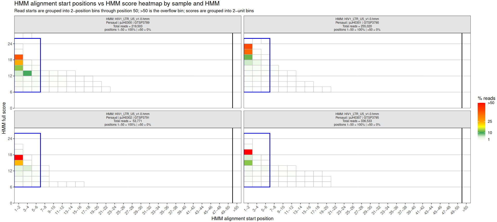

# INSPIIRED2

INSPIIRED2 identifies vector integration sites in reference genomes from paired-end Illumina short-read data. It is designed for linker-mediated libraries created using the original [INSPIIRED protocol](https://pubmed.ncbi.nlm.nih.gov/28344990). The structure of generated genomic fragments is shown below. The software labels reads originating from the LTR/ITR side of fragments as **anchor reads** because they are anchored to sites of vector integration.  Reads orginating from the linker side of fragments are labeled **adrift reads** because they their genomic align positions drift due random sonic sheering along the genome. 

<p align="center">
  
</p>

- **anchor reads** crosses the vector-genome junction. These reads begin with recognizable vector sequences and then transition into genomic sequences. Reads from short fragments that continue into linker sequences at the other end of fragments are automatically trimmed.

- **adrift reads** begins at the ligated linker and read into genomic sequences from the sonic-shearing boundary. Variation in this boundary provides the primary estimate of clonal abundance.

INSPIIRED2 demultiplexes and trims reads, recognizes vector-terminal sequence with a profile HMM, aligns both mates to a reference genome, constructs genomic fragments, standardizes fragment boundaries, filters likely PCR rearrangements, assembles fragments into sample-level integration sites, and adds gene and repeat annotations.

### System requirements

The supplied Docker image is the recommended execution environment because INSPIIRED2 depends on multiple R/Bioconductor packages and command-line tools including HMMER, BLAT, BLAST+, CD-HIT-EST, and UCSC sequence utilities. The versions of these packages and tools can affect results and using the provided Docker image ensures that results are reproducible. 

INSPIIRED2 uses Linux multicore processing. CPU, memory, disk, and shared-memory requirements depend on library size, read complexity, and the reference genomes used. A server with approximately 30 cores and 100 GB RAM is a reasonable starting point for substantial datasets, but these are not hard minimums. On smaller systems, reduce `--threads` values; memory use generally increases with the number of concurrent workers.

Temporary files are written below `--ramDiskPath`, which defaults to the server's RAM disk `/dev/shm`. If that location is not writable, INSPIIRED2 uses the output directory. The Docker `--shm-size` setting controls the space available in `/dev/shm`.

### Installation

Using the provided Docker image [[download here (7 GB)](https://bushmanlab.org/export/inspiired2_latest.tar.gz)] is the reccomended installation method. The documentation below will refer to this method. Alternatively, the software can be installed directly on your system by cloning this repository and calling inspiired2.R. The software requires a number of R libraries to be preinstalled as well as third party software packages (blastn, nhmmer, cd-hit-est). 


### Required inputs

Inspiired2 requires three inputs. 
  - Paired end sequencing (R1, R2, I1) with readIDs in the same order between files.
  - A [sample data](sampleData.tsv) file matching sample replicates to I1 barcode sequecnes and linker sequences.
  - A [bash script](https://github.com/helixscript/INSPIIRED2/blob/main/run.sh) calling one or more INSPIIRED2 modules.  


### Quick start and validation
Download and load the distributed Docker image:

```
wget https://bushmanlab.org/export/inspiired2_latest.tar.gz
```
```bash
docker load -i inspiired2_latest.tar.gz
```
Run the bundled synthetic test:

```
docker run --rm -it --shm-size=5g inspiired2 bash
```

```
cd /opt/INSPIIRED2/tests/synTests/U5_50sites_seed1
```
```bash
./run.sh
```

The test takes about 5 minutes to complete and report PASS at the end will if the MD5sum of the output matches the expected value. 

### Starting analyses using the Docker image

The basic INSPIIRED2 invocation command has this structure:
```
docker run --rm     \
  --shm-size=20g    \
  -v ./:/workspace  \
  -w /workspace     \
  inspiired2 bash run.sh
```
The`--shm-size` flag defines the max. amount of memory allowed to be used as scratch space during analysis. 20GB is a reasonable value for most moderate size Illumina paied-end data sets. This value should be increased for large data sets and should not reach an appreciable percentage of your total RAM. 

` -v ./:/workspace` mounts your analysis directory to `/workspace` inside of the Docker container. Here we are mounting the current directory `./` to `/workspace` within the Docker container. The analysis directory is expected to contain your sequencing data, sample data file, and processing script (described next).

`-w /workspace` instructs Docker to make all paths relative to `/workspace` within the Docker image.

`inspiired2 bash run.sh` instructs docker to run the processing script [run.sh](https://github.com/helixscript/INSPIIRED2/blob/main/run.sh), located in your analysis directory, in a Docker container created with the `inspiired2` Docker image.

By default, all output files will be owned by root. To change ownership to the user initiating the analysis, add this argument:  `--user "$(id -u):$(id -g)"`

### Resource data files

INSPIIRED2 is provided with a number of reference genomes (hg38, hs1, sacCer3, mm10, canFam4, and macFas5) as well as U3 and U5 LTR HMMs created with data from Los Alamos National laboratories. The `showResources` command can be used to list available resources provided with the Docker image. All genomes and genome annotations were created with the included `tools/buildRefGenomeObjects.R` script. This script accepts UCSC genome IDs and pulls data from UCSC data portals to build required data objects. A local install of RepeatMasker is required to create *.repeatTable.gz files required by the `annotateRepeats` module.  

```
%>docker run --rm inspiired2 bash -c 'inspiired2 showResources' 

+-- data 
+-- genomeAnnotations 
|   +-- hg38.TUs.rds 
|   +-- hg38.exons.rds 
|   +-- hg38.repeatTable.gz 
    ...
|   +-- sacCer3.TUs.rds 
|   +-- sacCer3.exons.rds 
|   \-- sacCer3.repeatTable.gz 
+-- hmms 
|   +-- HIV1_LTR_U3_v1.0.cfg 
|   +-- HIV1_LTR_U3_v1.0.hmm 
|   +-- HIV1_LTR_U5_v1.0.cfg 
|   +-- HIV1_LTR_U5_v1.0.hmm 
    ...
|   +-- validation.cfg 
|   \-- validation.hmm 
+-- referenceGenomes 
|   +-- canFam4.2bit 
|   +-- hg38.2bit 
|   +-- hs1.2bit 
|   +-- macFas5.2bit 
|   +-- mm10.2bit 
|   \-- sacCer3.2bit 
\-- vectors 
 +-- CART19.fasta 
 +-- HXB2.fasta 
 \-- synDataTest.fasta
 ```

In this data tree, reference genomes, stored in the referenceGenomes directory, are stored using the 2bit data format and are named with an identifier followed by '.2bit'. Genome annotations are stored in the genomeAnnotations directory. For each genome identifier, *.TUs.rds files stores gene transcription unit coordinates and *.exons.rds files store gene exon coordinates. Coordinates are stored as GenomicRange objects. Repeat annotations, created by RepeatMasker, are stored in *.repeatTable.gz files. These files contain the compressed tabular output created by RepeatMasker. Vector FASTA file are stored in the vectors directory and HMMs are stored in the hmms directory. Vector FASTA files are used to filter out anchor reads which read into the vector bodies rather than into flanking genomic DNA. Each HMM has a corresponding configuration file where the .hmm suffix of the HMM has been replaced with .cfg (discussed in the HMM section below).


Custom reference genomes, gene annotations, vector sequences, and HMMs can be shared with the Docker image at run time by using an additional mount flag: `-v  ~/data:/resources:ro` to overlay custom files onto INSPIIRED2's data file tree. In this example, we are mounting our local file tree  `~/data` to `/resources` within the Docker container. Custom data must be organized in the same way that data is organized within INSPIIRED's data folder. 
```
%> tree ~/data 
  ~/data  
    └── hmms  
        └── myCustomProfile.hmm
 ```

When data matching INSPIIRED2's data tree is mounted to `/resources` in the Docker container, the data is superimposed onto the INSPIIRED2's data file tree and overwrites existing entries if the same names are used, eg.

```
docker run --rm -v  ~/data:/resources:ro inspiired2 bash -c 'inspiired2 showResources'
```
```
(...)
|   +-- sacCer3.exons.rds 
|   \-- sacCer3.repeatTable.gz 
+-- hmms 
|   +-- HIV1_LTR_U3_v1.0.cfg 
|   +-- HIV1_LTR_U3_v1.0.hmm 
|   +-- HIV1_LTR_U5_v1.0.cfg 
|   +-- HIV1_LTR_U5_v1.0.hmm 
|   +-- generic_CART19_v1.0.cfg 
|   +-- generic_CART19_v1.0.hmm 
|   +-- myCustomProfile.hmm   <===== overlayed data file 
|   +-- validation.cfg 
|   \-- validation.hmm 
+-- referenceGenomes 
|   +-- canFam4.2bit 
|   +-- hg38.2bit
(...)
```


### Sample data file

A tab delimited file defining sample replicate barcode and linker sequences is required to demultiplex sequencing runs. This file is a required parameter for the demultiplex module. An example file is provided with the software [`sampleData.tsv`](sampleData.tsv).

| Column | Description |
|---|---|
| `trial` | Study, experiment, or analysis-group identifier. |
| `subject` | Biological subject identifier. Integration positions are standardized across samples and replicates within each `trial`/`subject`. |
| `sample` | Sample identifier. Final site records are assembled at this level. |
| `replicate` | Technical-replicate identifier. Values must be integers. |
| `index1Seq` | Expected Index 1 barcode sequence. |
| `adriftReadLinkerSeq` | Complete linker sequence at the beginning of the adrift read, with the UMI represented by `N` characters. |
| `refGenome` | Reference identifier matching an installed `<refGenome>.2bit` file. |
| `leaderSeqHMM` | HMM filename, including `.hmm`, used to recognize the vector-terminal sequence in anchor reads. |
| `vectorFastaFile` | Vector FASTA filename used by the internal-vector read filter. |
| `mode` | Vector-end detection mode(`U3` or `U5`). |

Example:

```text
trial	subject	sample	replicate	index1Seq	adriftReadLinkerSeq	refGenome	leaderSeqHMM	vectorFastaFile	mode
trial1	subject01	day0	1	CAGTGGGTCTAA	GAACGAGCACTAGTAAGCCCNNNNNNNNNNNNCTCCGCTTAAGGGACT	hg38	HIV1_1-100_U5.hmm	HXB2.fasta	U5
```

Every `adriftReadLinkerSeq` must contain one contiguous UMI region (Ns) and match, case-insensitively:

Additional requirements:

- Resource names are case-sensitive and must match installed HMM, vector, and reference files.
- Barcodes and linkers should remain distinguishable after the configured mismatch allowances are applied.

<br>

## Standard workflow

The pipeline is a daisy chain: the primary RDS file output of one module becomes the input to the next. Modules are chained together in a shell script which is passed to the Docker image.

```bash
#!/usr/bin/env bash
set -euo pipefail

inspiired2 demultiplex --outputDir out  \
  --sampleData sampleData.tsv           \
  --indexReads I1.fastq.gz              \
  --adriftReads R1.fastq.gz             \
  --anchorReads R2.fastq.gz

inspiired2 prepReads         --outputDir out --inputData out/demultiplex.rds
inspiired2 alignReads        --outputDir out --inputData out/prepReads.rds
inspiired2 buildFragments    --outputDir out --inputData out/alignReads.rds
inspiired2 buildStdFragments --outputDir out --inputData out/buildFragments.rds
inspiired2 buildSites        --outputDir out --inputData out/buildStdFragments.rds
inspiired2 nearestGenes      --outputDir out --inputData out/buildSites.rds
inspiired2 annotateRepeats   --outputDir out --inputData out/nearestGenes.rds
```

Setting `set -euo pipefail` at the top of processing script instructs the script to stop at the first failed module.

| Module | Main role | Primary output |
|---|---|---|
| `demultiplex` | Quality-trim and assign reads using Index 1 and linker sequences | `demultiplex.rds` |
| `prepReads` | Recognize vector-terminal sequence and prepare genomic read segments | `prepReads.rds` |
| `alignReads` | Align anchor and adrift genomic sequences to reference genomes | `alignReads.rds` |
| `buildFragments` | Pair compatible mate alignments into candidate physical fragments | `buildFragments.rds` |
| `buildStdFragments` | Standardize boundaries, handle multi-hits, filter PCR artifacts, and collapse fragments | `buildStdFragments.rds` |
| `buildSites` | Assemble sample-level integration sites and calculate abundance | `buildSites.rds` |
| `nearestGenes` | Add gene, exon, and nearest-gene annotations | `nearestGenes.rds` |
| `annotateRepeats` | Add overlapping repeat names and classes | `annotateRepeats.rds` |

`showResources`, `testHMMs`, `buildSeqDataMap`, `testDBconn`, and `pullDBrecords` are supporting commands rather than required stages of the standard chain.

<br>

### Working with HMMs
Anchor reads containing the ends of vector LTR sequences are recognized using vector specific HMMs. HMMs are used because them are particularly adept at recognizing mismatches and minor indels that can occur due to natural variation and sequencing error.  Vector HMMs are created with the HMMER software package for each vector used in your analysis. To create a vector HMM, first create a FASTA file for the expected vector sequence you expect to observe in your R2 read sequences. This will be the expected sequence observed before transitioning into genomic DNA, eg.

```
docker run -it --rm  inspiired2 bash
```

```
echo -e ">seq\nGAAAATCTCTAGCA" > test.ff
```

Next, use HMMER to create a HMM with this FASTA file.
```
hmmbuild test.hmm test.fasta
```

Now that we created an HMM, we need to determine how to score it. Next create a FASTA file containing minor variations in your sequence to see how it affects the HMM score. For example, here we create a file name *mySeqTests.fasta* and make minor changes which we would still consider valid hits.

``` 
echo ">seq
GAAAATCTCTAGCA
>seq_1SNP
GAAGATCTCTAGCA
>seq_2SNPs
GAAGATCTCAAGCA
>seq_1del
GAAAATTCTAGCA
>seq_1del_1ins
GAAATCTCTGAGCA" > test2.ff
```
Once we create a couple of minor variations in our target sequence, we evaluate the variations with our HMM.  
First run this command to evaluate the test sequences:

```
nhmmer --F1 1 --F2 1 --F3 1 -T -5 --incT -5 --nobias --popen 0.15 --pextend 0.05 --tblout out.tbl test.hmm test2.ff
```

Next, review the output (out.tbl) to determine a minimum acceptable score:
  
```
# target name        accession  query name           accession  hmmfrom hmm to alifrom  ali to envfrom  env to  sq len strand   E-value  score  bias  description of target
#------------------- ---------- -------------------- ---------- ------- ------- ------- ------- ------- ------- ------- ------ --------- ------ ----- ---------------------
seq                  -          test                 -                1      14       1      14       1      14      14    +      0.0063    3.7   1.1  -
seq_1SNP             -          test                 -                1      14       1      14       1      14      14    +       0.016    2.8   0.3  -
seq_2SNPs            -          test                 -                1      13       1      13       1      14      14    +        0.15    0.5   0.9  -
seq_1del_1ins        -          test                 -                3      10       2       9       1      14      14    +        0.29   -0.1   0.2  -
seq_1del             -          test                 -                4      13       3      12       1      13      13    +        0.38   -0.4   1.2  -
```
  
Examine the HMM scores in column 14 (score) and make a decision about the lowest score that provides an acceptable match. In this example, we will go with 0.5. Next we will create an settings file for the new HMM. This file needs to have the same name as the HMM file except we replace ".hmm" with ".cfg". The settings file provides default scoring parameters for the HMM. Here is an example:
  
```
HMMminStartPos  1
HMMmaxStartPos  5
HMMminFullBitScore      10
HMMmaxFullBitScore      30
HMMmatchEnd     TRUE
HMMmatchTerminalSeq     CA
HMMmatchEndRadius       2
```

### Field definitions

| Field | Example value | Definition |
|---|---|---|
| `HMMminStartPos` | `1` | Earliest allowed start of the HMM alignment on the anchor read. Positions are 1-based, measured from the beginning of the read. Must be an integer of at least `1`. |
| `HMMmaxStartPos` | `5` | Latest allowed start of the HMM alignment on the anchor read. Must be an integer greater than or equal to `HMMminStartPos`. The start-position bounds are inclusive. |
| `HMMminFullBitScore` | `10` | Minimum accepted `nhmmer` bit score, inclusive. Hits below this value are rejected. Must be a finite number; decimal and negative values are permitted. |
| `HMMmaxFullBitScore` | `30` | Maximum accepted `nhmmer` bit score, inclusive. Hits above this value are rejected, even if they are stronger matches. Must be finite and greater than or equal to `HMMminFullBitScore`. |
| `HMMmatchEnd` | `TRUE` | Whether to require the alignment to reach the end of the HMM within the tolerance set by `HMMmatchEndRadius`. Accepts `TRUE` or `FALSE`, case-insensitively. This checks the model-end position; it does not require alignment from the first position of the model. |
| `HMMmatchTerminalSeq` | `CA` | Exact nucleotide sequence required near the alignment endpoint on the anchor read. Its final base becomes the leader endpoint used for trimming. Set to `none` to disable this check. Sequences are converted to uppercase and may contain `A`, `C`, `G`, `T`, or `N`; matching is literal, so `N` is not a wildcard. |
| `HMMmatchEndRadius` | `2` | Non-negative integer tolerance used for both the HMM-end check and the terminal-sequence search. For the model-end check, it is the allowed difference between the model length and the last aligned model position. For terminal matching, it is the allowed shift of the motif's final base from the alignment endpoint on the read. |

Start positions refer to the **anchor read**, while `HMMmatchEnd` evaluates positions within the **HMM model**. The model length is read from the `LENG` entry in the `.hmm` file.


Once an HMM is created, default scoring parameters should be defined based on the initial testing and then it should be tested on real data. The `testHMMs` module reads in the output of the demultiplex module and runs demultiplexed reads through their associated HMMs. HMM scores and HMM alignment start positions are plotted on a grid. HMM hits that would be included in an analysis are within the blue box drawn atop of the grid. The position of the blue box is determined by the HMM processing parameters which are passed to the module using the `--HMMparams` flag. This flag accepts a comma delimited string of the processing parameters shown above. Adjust parameters until the blue box is gating scores in an manner appropriate for your work. These settings should be recorded in an HMM cfg file to be used in the future. If you are working with wild infections or anchor reads start from multiple locations within LTRs, this configuration should be done for each sequencing run and specific HMM parameters should be passed to the `prepReads` module with the same  `--HMMparams` flag rather than relying on the HMMs default scoring parameters stored in its .cfg file.


```
inspiired2 testHMMs --outputDir out --outputDir INSPIIRED2   \
--inputData INSPIIRED2/demultiplex.rds                       \
--HMMparams 'HIV1_LTR_U5_v1.0.hmm,1,6,6,26,TRUE,CA,2'        \
--scoreBinWidth 2 --startPosBinWidth 2 --minScoreBinPct 1
```

<p align="center">
  
</p>

<br>

## General command behavior

Core modules accept the following options:

| Flag | Default | Meaning |
|---|---:|---|
| `--outputDir` | Required | Output directory. It is normally created during module setup. |
| `--inputData` | Required | RDS output from the preceding module. `demultiplex` uses raw input flags instead. |
| `--threads` | `50` | Maximum worker or library thread count.  |
| `--fileTag` | Module name | Base name for output files. Allows modules to be run more than once by changing their output file base names.  |
| `--ramDiskPath` | `/dev/shm` | Scratch filesystem; falls back to `outputDir` when not writable. |

<br>


## Core analysis modules

INSPIIRED2 identifies vector integration sites from paired-end sequencing data. **Anchor reads** begin on the vector side of a fragment and cross the vector–genome junction. **Adrift reads** begin at the linker attached to the sheared genomic end. Different shearing boundaries provide evidence of independent recovered DNA fragments.

The standard workflow contains eight core modules. Each saves an RDS result that can be used to restart the workflow at the next stage.

| Module | Main input | Default main output | Purpose |
|---|---|---|---|
| `demultiplex` | Sample table and synchronized I1/R1/R2 FASTQ files | `demultiplex.rds` | Assign read pairs to sample replicates and trim their linker/low-quality sequence. |
| `prepReads` | `demultiplex.rds` | `prepReads.rds` | Recognize the vector leader, recover genomic sequence, and filter internal-vector reads. |
| `alignReads` | `prepReads.rds` | `alignReads.rds` | Align both mates to their assigned reference genomes. |
| `buildFragments` | `alignReads.rds` | `buildFragments.rds` | Combine mate alignments into candidate genomic fragments. |
| `buildStdFragments` | `buildFragments.rds` | `buildStdFragments.rds` | Standardize boundaries, resolve supported multi-mapping reads, and filter competing fragment evidence. |
| `buildSites` | `buildStdFragments.rds` | `buildSites.rds` | Assemble sample-level integration sites and calculate abundance measures. |
| `nearestGenes` | `buildSites.rds` | `nearestGenes.rds` | Add gene, exon, and nearest-gene annotations. |
| `annotateRepeats` | `nearestGenes.rds` | `annotateRepeats.rds` | Add overlapping repeat annotations. |

This reference describes **INSPIIRED2 1.6.3**, checked against [commit `1cf3fe3`](https://github.com/helixscript/INSPIIRED2/tree/1cf3fe3ea3a99fc408b5dcea2bec29518683dbb5). Each module table includes every option exposed by `inspiired2 <module>`, with one option per row. Required arguments and defaults follow the launcher in [inspiired2.R](inspiired2.R).

### Command conventions and shared behavior

Use `inspiired2 <module> [options]`.

Options marked **Required** have no default. Boolean flags default to `FALSE`: supply the flag by itself to set it to `TRUE`, and omit it to keep `FALSE`. Do not append `TRUE` or `FALSE` to a flag. String values containing spaces, regular expressions, or a pipe must be quoted. The value `none` is a literal sentinel string where shown.

The default `--fileTag` is the module name. Each core module writes `<fileTag>.rds`, a `<fileTag>.log` execution log, a `<fileTag>.yml` parameter record, and a `<fileTag>.done` marker after successful completion. Additional outputs are listed under the relevant module. Existing RDS files are not an automatic skip/resume mechanism: an invoked module runs again.

Temporary working files use `--ramDiskPath`, normally `/dev/shm`; an unwritable path falls back to the output directory. Some intermediate files also use a `<fileTag>_tmp` directory under the output directory. Temporary working directories are cleaned up when a module exits. The shared initialization sets data.table's thread count, but individual modules differ in how much work they parallelize; each table explains the actual use of `--threads`.

The following options apply to the **top-level command**, before any module name:

| Option | Example | Effect |
|---|---|---|
| `--help` | `inspiired2 --help` | Print launcher help and the available subcommands. |
| `--version` | `inspiired2 --version` | Print the installed INSPIIRED2 version and exit. |

### demultiplex: assign read pairs to sample replicates

`demultiplex` assigns synchronized read pairs to the libraries defined in a sample table. Assignment normally requires a matching Index 1 barcode and matching linker segments before and after the UMI on the adrift read.

**Inputs:** a tab-delimited sample table with a header, plus synchronized Index 1, adrift, and anchor FASTQ files. Plain and gzip-compressed FASTQ input can be used. In the standard library layout, adrift reads are R1 and anchor reads are R2.

**Outputs:** `demultiplex.rds`, containing assigned read pairs, sequences, metadata, UMIs or placeholders, and `nReads`; and `demultiplex.tbl`, the sample table with `demultiplexedReads` totals added. Sample rows with no assigned reads receive a count of zero.

```bash
inspiired2 demultiplex --outputDir out \
  --sampleData sampleData.tsv          \
  --indexReads I1.fastq.gz             \
  --adriftReads R1.fastq.gz            \
  --anchorReads R2.fastq.gz
```

The module checks that all three FASTQ streams contain matching read IDs in the same order. It optionally reverse-complements Index 1 reads based on barcode matches, optionally applies Golay correction, and quality-trims both mates. Reads must remain long enough to accommodate the longest configured linker plus at least one additional base before assignment. After matching, the module extracts the UMI, removes the entire configured linker from the adrift read, trims matching poly-G tails, and removes pairs with empty sequences.

All occurrences of a read ID assigned more than once are discarded. By default, identical UMI/anchor/adrift sequence combinations are then collapsed within each trial, subject, sample, and replicate, with the original read-pair count stored in `nReads`.

| Option | Value type | Default | Explanation |
|---|---|---|---|
| `--outputDir` | path | **Required** | Directory for this module's result files, log, parameter record, and completion marker. Create it before starting the workflow. |
| `--sampleData` | path | **Required** | Tab-delimited sample definition file, with a header and one row per library/sample replicate. Required columns are defined below. |
| `--indexReads` | path | **Required** | Index 1 FASTQ file, optionally gzip-compressed. Records must be synchronized with both mate files. |
| `--adriftReads` | path | **Required** | FASTQ file for the linker-side mate, normally R1. This read begins with the linker/UMI structure and continues into genomic DNA. |
| `--anchorReads` | path | **Required** | FASTQ file for the vector-side mate, normally R2. This read contains the vector-terminal leader followed by genomic DNA. |
| `--threads` | integer | `50` | Number of parallel demultiplexing workers. FASTQ input is streamed in batches of up to one million read pairs; this option also sets the data.table thread count. |
| `--fileTag` | string | `demultiplex` | Output filename prefix. For example, run1 produces run1.rds, run1.log, run1.yml, and run1.done, plus any module-specific audit files. |
| `--index1ReadMaxMismatch` | integer | `1` | Maximum number of nucleotide mismatches allowed when matching the sample Index 1 barcode. Use a non-negative integer; 0 requires an exact match. |
| `--disableAutoBarcodeOrt` | flag | `FALSE` | Skip automatic Index 1 orientation detection and leave index reads in their supplied orientation. By default, the first input batch is compared with the sample barcodes in both orientations; all index reads are reverse-complemented when that orientation has more exact matches. |
| `--disablePostUmiLinker` | flag | `FALSE` | Skip sequence matching of the linker segment after the UMI. The configured linker coordinates are still used to extract the UMI and trim the linker. |
| `--postUmiLinkerMaxMismatch` | integer | `1` | Maximum mismatches in the linker segment after the UMI. Has no effect when post-UMI linker matching is disabled. |
| `--qualTrimHalfWidth` | integer | `3` | Half-width, in nucleotides, of the sliding window passed to ShortRead trimTailw for quality-based tail trimming of both mates. |
| `--qualTrimEvents` | integer | `2` | Number of failing quality events in the trimming window used by trimTailw to trigger tail trimming. |
| `--qualTrimScore` | integer | `10` | Phred quality threshold for tail trimming. The code converts this score to its Phred+33 quality character before calling trimTailw. |
| `--polyGfilterPattern` | string | `G{5,}[ATCN]?G{5,}.*$` | Regular expression used to remove a matching tail from each mate. The default finds at least five Gs, optionally one A/T/C/N, at least five more Gs, and everything following that run. Quote a custom expression. |
| `--disablePolyGfilter` | flag | `FALSE` | Skip regular-expression poly-G tail removal from both mates. Quality trimming and adrift linker removal still occur. |
| `--correctGolayIndexReads` | flag | `FALSE` | Attempt correction of 12-nucleotide Golay Index 1 barcodes before barcode matching. Index reads that cannot be corrected retain their original sequence and still undergo ordinary barcode matching. |
| `--disableAdriftReadLinkers` | flag | `FALSE` | Skip matching the linker segment before the UMI. Post-UMI matching is controlled independently, and linker/UMI extraction and linker trimming still occur. |
| `--adriftReadLinkerMaxMismatch` | integer | `1` | Maximum mismatches in the linker segment before the UMI. Has no effect when that linker-matching step is disabled. |
| `--ramDiskPath` | path | `/dev/shm` | Parent directory for a unique temporary working directory. If this path is not writable, shared initialization uses the output directory. Selecting a path does not allocate RAM or change its capacity. |
| `--disableSequenceCollapse` | flag | `FALSE` | Retain one record per assigned read pair instead of collapsing records with identical UMI, anchor sequence, and adrift sequence within each trial/subject/sample/replicate. |
| `--captureUMIs` | flag | `FALSE` | Preserve extracted UMI sequences in the output for downstream processing. By default, UMIs are replaced by the common placeholder AAAAAAAAAAAA after duplicate collapsing. |
| `--help` | flag | — | Print this module's command-line help and exit. |
| `-h` | flag | — | Short form of the module help option. |

**Required sample-table fields**

| Field | Meaning |
|---|---|
| `trial` | Trial or study identifier. |
| `subject` | Subject identifier within the trial. |
| `sample` | Sample identifier within the subject. |
| `replicate` | Technical-replicate identifier; downstream modules convert it to an integer. |
| `index1Seq` | Expected Index 1 barcode sequence. |
| `adriftReadLinkerSeq` | Full adrift linker sequence, with the UMI represented by a contiguous run of `N` bases. The current validator requires at least three A/C/G/T bases, at least five Ns, and at least three A/C/G/T bases, in that order. |
| `refGenome` | Reference-genome identifier matching a `.2bit` filename without its extension in `data/referenceGenomes`. |
| `vectorFastaFile` | Vector FASTA filename present in `data/vectors`. |
| `leaderSeqHMM` | HMM filename present in `data/hmms`. |
| `mode` | Detection mode. The validator accepts `U3`, `U5`, or the literal string `NA`; see the mode-handling notes below. |

The two linker-matching switches are independent. Disabling the pre-UMI linker test does not disable the post-UMI test. Disabling either or both tests also does not remove the requirement for a valid linker definition, or change the coordinates used for UMI extraction and linker removal.

**UMI handling:** duplicate collapsing uses the extracted UMI even when `--captureUMIs` is absent, because replacement with `AAAAAAAAAAAA` occurs afterward. Enable `--captureUMIs` at this stage if downstream UMI analysis is required. Later flags cannot recover discarded sequences. Site abundance remains based on fragment-length diversity; capturing UMIs supplies an additional output measure.

Sources: [modules/demultiplex.R](modules/demultiplex.R), [lib/demultiplex.R](lib/demultiplex.R).

### prepReads: trim sequencing reads and recognize the vector sequences

`prepReads` locates the vector-terminal at the beginning of each anchor read, saves it separately, and removes it to expose the genomic sequence for alignment. It also trims reads that extend through short inserts and filters likely internal-vector reads.

**Input:** `demultiplex.rds`, which includes each sample replicate's HMM, HMM configuration, and vector FASTA resources.

**Outputs:** `prepReads.rds`, containing genomic read pairs and the recovered vector sequence; and `prepReads_vectorHitReads.tsv.gz`, containing pairs rejected by the vector screen when that screen is enabled.

```bash
inspiired2 prepReads --outputDir out --inputData out/demultiplex.rds
```

The module runs `nhmmer`, chooses the highest-scoring forward-strand hit per anchor read, and then applies the configured start-position, score, model-end, and terminal-sequence requirements. A read whose selected hit fails these requirements is rejected. The sequence from the first read base through the accepted leader endpoint is stored as `leaderSeq`; the next base begins the genomic anchor sequence.

For over-read trimming, the module searches anchor reads for a reverse-complemented linker segment and adrift reads for a reverse-complemented leader segment. When several pattern matches occur, it uses the last match and trims immediately before it, provided the match begins after the first base. Both resulting mates must satisfy the minimum length. The final BLAST screen removes pairs whose anchor-read tail matches the assigned vector at the required identity and coverage.

| Option | Value type | Default | Explanation |
|---|---|---|---|
| `--outputDir` | path | **Required** | Directory for this module's result files, log, parameter record, and completion marker. Create it before starting the workflow. |
| `--inputData` | path | **Required** | Path to the demultiplex RDS output, normally out/demultiplex.rds. |
| `--threads` | integer | `50` | Number of parallel HMM-processing workers and requested threads for the parallel BLAST vector screen; also sets data.table threads. |
| `--fileTag` | string | `prepReads` | Output filename prefix. For example, run1 produces run1.rds, run1.log, run1.yml, and run1.done, plus any module-specific audit files. |
| `--ramDiskPath` | path | `/dev/shm` | Parent directory for a unique temporary working directory. If this path is not writable, shared initialization uses the output directory. Selecting a path does not allocate RAM or change its capacity. |
| `--disableOverReadTrimming` | flag | `FALSE` | Skip trimming reads that extend through the genomic insert into the opposite linker or leader. In this implementation, this also skips the minimum-read-length filter inside that step; empty reads are still removed after leader extraction. |
| `--disableVectorFilter` | flag | `FALSE` | Skip the BLAST screen for vector sequence at the genomic anchor-read tail. The vector-hit audit file is not produced when this screen is disabled. |
| `--ORtrimPatternWidth` | integer | `8` | Positive number of bases taken from reverse-complemented linker2 and recovered leader sequences to recognize over-reading. Both source sequences must be at least this long. |
| `--ORseqMaxMismatch` | number | `0.10` | Allowed mismatch fraction, expressed from 0 to 1, for an over-read pattern. The integer allowance is ceiling(pattern width × fraction); the defaults therefore allow one mismatch in an eight-base pattern. |
| `--minReadLength` | integer | `30` | Minimum number of bases required in each genomic mate after over-read trimming. Both mates must pass. This filter is active only when over-read trimming is enabled. |
| `--vectorTestWidth` | integer | `25` | Number of bases taken from the end of the genomic anchor read for the vector BLAST screen. This configured width is also the denominator used for hit coverage. |
| `--vectorTestMinPercentID` | number | `90` | Minimum BLAST nucleotide identity, expressed as a percentage from 0 to 100, for a vector hit. A qualifying hit must also pass the coverage threshold. |
| `--vectorTestMinCoverage` | number | `90` | Minimum percentage of the configured vector-test width covered by a BLAST alignment. Coverage is 100 × alignment length / vector-test width. |
| `--HMMparams` | string | `none` | Quoted override string defining the seven processing parameters for each HMM. The default reads matching .cfg files. If overrides are supplied, include every HMM used by the input; syntax and fields are defined below. |
| `--help` | flag | — | Print this module's command-line help and exit. |
| `-h` | flag | — | Short form of the module help option. |

**HMM configuration and override fields**

By default, `data/hmms/<name>.hmm` uses the matching `data/hmms/<name>.cfg`. A configuration contains exactly seven records in two tab-separated columns, with no header: field name, then value. Each field must occur once. Field order in the file is flexible because the parser matches names.

| Field | Value type | Meaning |
|---|---|---|
| `HMMminStartPos` | integer ≥ 1 | Earliest accepted alignment start on the anchor read, using 1-based coordinates. |
| `HMMmaxStartPos` | integer | Latest accepted alignment start on the anchor read, inclusive; must be at least the minimum start. |
| `HMMminFullBitScore` | finite number | Minimum accepted `nhmmer` bit score, inclusive. |
| `HMMmaxFullBitScore` | finite number | Maximum accepted bit score, inclusive; must be at least the minimum score. Hits above this maximum are rejected. |
| `HMMmatchEnd` | `TRUE` or `FALSE` | Whether to require the last aligned model position to lie within the configured end radius of the HMM's full length. |
| `HMMmatchTerminalSeq` | sequence or `none` | Exact terminal sequence required near the alignment endpoint on the read. Its final base sets the leader endpoint. `none` disables this check. Matching is literal; `N` is not a wildcard. |
| `HMMmatchEndRadius` | integer ≥ 0 | Tolerance in bases for the model-end check and for shifting the terminal motif's final base relative to the read alignment endpoint. |

A data/hmms/<name>.cfg configuration file has this format:

```text
HMMminStartPos	1
HMMmaxStartPos	5
HMMminFullBitScore	10
HMMmaxFullBitScore	30
HMMmatchEnd	TRUE
HMMmatchTerminalSeq	CA
HMMmatchEndRadius	2
```

For `--HMMparams`, an entry contains the HMM filename followed by the seven values in the table order:

```text
HMM_filename,min_start,max_start,min_score,max_score,match_end,terminal_sequence,end_radius
```

For example:

```bash
inspiired2 prepReads --outputDir out --inputData out/demultiplex.rds --HMMparams 'HIV1_LTR_U5_v1.0.hmm,1,5,10,30,TRUE,CA,2'
```

Parameter sets for more than one HMM can be provided separated with a `|` inside the quoted argument. When using .cfg file overrides, provide an entry for every HMM represented in the input. 

Terminal matching uses the first exact motif match from left to right within its search window. For example, an alignment endpoint of 50, motif `CA`, and radius 2 searches read bases 47–52, allowing the motif's final base at positions 48–52. Model-end matching and terminal-sequence matching can be disabled independently through their respective configuration fields.

The supporting `testHMMs` command can inspect score/start-position distributions before choosing settings.

Sources: [modules/prepReads.R](modules/prepReads.R), [supplied U5 configuration](data/hmms/HIV1_LTR_U5_v1.0.cfg).

### alignReads: align both mates to reference genomes

`alignReads` aligns genomic anchor and adrift sequences to a reference genome with BLAT. It retains every alignment passing the alignment filters so later stages can evaluate multiple alignments using paired-read and site-support evidence.

**Inputs:** `prepReads.rds` and `data/referenceGenomes/<refGenome>.2bit` for each reference genome represented in the input.

**Output:** `alignReads.rds`, an R list containing separate `anchorReads` and `adriftReads` alignment tables, joined to their read sequences and metadata.

```bash
inspiired2 alignReads --outputDir out --inputData out/prepReads.rds
```

Identical sequences are aligned once per reference genome, then their alignments are joined back to all corresponding read records. Anchor reads are aligned first. Only adrift reads whose anchor mate has an accepted alignment are processed. Stored query and genomic alignment coordinates use 1-based, inclusive intervals.

BLAT runs with permissive built-in score and identity settings (-minScore=0 and -minIdentity=0); INSPIIRED2 then applies its own identity, query-span coverage, and insertion filters. All of these filters must pass.

**All command-line options**

| Option | Value type | Default | Explanation |
|---|---|---|---|
| `--outputDir` | path | **Required** | Directory for this module's result files, log, parameter record, and completion marker. Create it before starting the workflow. |
| `--inputData` | path | **Required** | Path to the prepReads RDS output, normally out/prepReads.rds. |
| `--threads` | integer | `50` | Maximum number of concurrent BLAT alignment workers. The module starts no more workers than available chunks, and also sets data.table threads. |
| `--fileTag` | string | `alignReads` | Output filename prefix. For example, run1 produces run1.rds, run1.log, run1.yml, and run1.done, plus any module-specific audit files. |
| `--ramDiskPath` | path | `/dev/shm` | Parent directory for a unique temporary working directory. If this path is not writable, shared initialization uses the output directory. Selecting a path does not allocate RAM or change its capacity. |
| `--minPercentID` | number | `95` | Minimum accepted alignment identity percentage, from 0 to 100, as calculated by the bundled pslScore.pl. Applied after BLAT returns alignments. |
| `--minAlignmentCoverage` | number | `95` | Minimum percentage of query length spanned by the alignment, from 0 to 100. Calculated as 100 × (query end − query start + 1) / query length after conversion to 1-based coordinates; it is a span measure, not the percentage of identical bases. |
| `--blatStepSize` | integer | `5` | Spacing, in bases, between BLAT seed tiles; passed as BLAT stepSize. A smaller spacing uses more seeds. Must be at least 1. |
| `--blatTileSize` | integer | `11` | Length, in bases, of BLAT seed tiles; passed as BLAT tileSize. Controls the exact-match seed length used to initiate alignments. Must be at least 1. |
| `--blatRepMatch` | integer | `3000` | Repeat-frequency threshold passed as BLAT repMatch, controlling suppression of overly frequent seed tiles. Must be at least 1. |
| `--blatMaxtNumInsert` | integer | `1` | Maximum accepted PSL tNumInsert: the number of target-side insertion/gap events. A non-negative post-alignment filter. |
| `--blatMaxqNumInsert` | integer | `1` | Maximum accepted PSL qNumInsert: the number of query-side insertion/gap events. A non-negative post-alignment filter. |
| `--blatMaxtBaseInsert` | integer | `1` | Maximum accepted PSL tBaseInsert: the total number of target-side bases in insertion/gap events. A non-negative post-alignment filter. |
| `--blatMaxqBaseInsert` | integer | `1` | Maximum accepted PSL qBaseInsert: the total number of query-side bases in insertion/gap events. A non-negative post-alignment filter. |
| `--dataRowChunkSize` | integer | `2500` | Maximum number of unique sequences per reference genome submitted to one alignment worker. Must be at least 1. Larger batches change work granularity and temporary-file size. |
| `--help` | flag | — | Print this module's command-line help and exit. |
| `-h` | flag | — | Short form of the module help option. |

Insertion **event counts** and inserted **base totals** are separate filters. For example, an alignment with one two-base target insertion passes a target-event limit of 1 but fails a target-base limit of 1. Increasing only the event limit does not relax the base-total limit.

Sources: [modules/alignReads.R](modules/alignReads.R), [BLAT parsing in lib/common.R](lib/common.R), [bin/pslScore.pl](bin/pslScore.pl).

### buildFragments: reconstruct candidate genomic fragments

`buildFragments` combines anchor and adrift alignments from the same read pair into rationale fragments spanning the vector–genome junction and a shearing boundary.

**Input:** `alignReads.rds`.

**Output:** `buildFragments.rds`, containing candidate fragment coordinates, strand, read sequences, recovered vector sequences, and sample metadata. Optional database export also saves fragment tables as Parquet files and records their metadata and filenames in SQL.

```bash
inspiired2 buildFragments --outputDir out --inputData out/alignReads.rds
```

Within each read-ID batch, the module evaluates combinations of mate alignments. Candidates must map to the same chromosome, have opposite alignment strands, and define a fragment length within the inclusive limits. The anchor alignment supplies the fragment strand. For a positive-strand anchor, the integration boundary is `fragStart`; for a negative-strand anchor, it is `fragEnd`. A read pair can produce several candidates when its alignments are ambiguous.

**All command-line options**

| Option | Value type | Default | Explanation |
|---|---|---|---|
| `--outputDir` | path | **Required** | Directory for this module's result files, log, parameter record, and completion marker. Create it before starting the workflow. |
| `--inputData` | path | **Required** | Path to the alignReads RDS output, containing anchorReads and adriftReads alignment tables. |
| `--threads` | integer | `50` | Sets the data.table thread count. The current outer loop over read-ID batches is sequential; this value does not create that many fragment-building workers. |
| `--fileTag` | string | `buildFragments` | Output filename prefix. For example, run1 produces run1.rds, run1.log, run1.yml, and run1.done, plus any module-specific audit files. |
| `--ramDiskPath` | path | `/dev/shm` | Parent directory for a unique temporary working directory. If this path is not writable, shared initialization uses the output directory. Selecting a path does not allocate RAM or change its capacity. |
| `--dataRowChunkSize` | integer | `5000` | Number of distinct read IDs processed in one fragment-building batch. Each batch can contain many more alignment combinations when reads map to multiple locations. |
| `--minFrgamentLength` | integer | `40` | Minimum accepted fragment length in bases, inclusive. Length is fragEnd − fragStart + 1. The spelling Frgament is required by the current interface. |
| `--maxFrgamentLength` | integer | `100000` | Maximum accepted fragment length in bases, inclusive. The spelling Frgament is required by the current interface. |
| `--dbConfigFile` | path | `none` | Path to a MariaDB/MySQL-format credential configuration file. Database/Parquet export is enabled only when this and the configuration-group identifier are both different from none. |
| `--dbConfigID` | string | `none` | Credential group name in the database configuration file, passed to RMariaDB as group. Both database configuration arguments are needed to enable export. |
| `--overwriteDBrecords` | flag | `FALSE` | Permit replacement of an existing database row with the same trial, subject, sample, replicate, reference genome, and mode. Without this flag, an existing row stops the export. Previous Parquet files are retained after replacement. |
| `--help` | flag | — | Print this module's command-line help and exit. |
| `-h` | flag | — | Short form of the module help option. |

**Database and Parquet export**

Supplying both database configuration values (--dbConfigFile and --dbConfigID) enables this optional export. The credential file is read by RMariaDB using the requested group. An external file system directory containing a marker file named `.inspiired` must be mounted to /data in the container. The main RDS result is written independently of this export.

Candidate fragments are grouped by trial, subject, sample, replicate, reference genome, and mode. Each group is written to an MD5-named Parquet file under `/data`. The SQL row stores these identifiers, the number of distinct fragment-coordinate records, and the Parquet filename. 

The supporting `pullDBrecords` command can select stored fragment groups and rebuild an RDS input for `buildStdFragments`.

Sources: [modules/buildFragments.R](modules/buildFragments.R), [database initialization in lib/common.R](lib/common.R).

### buildStdFragments: standardize boundaries and filter fragment evidence

`buildStdFragments` reduces small coordinate differences, resolves multi-mapping reads with unambiguous external support, filters competing anchor-sequence evidence, and consolidates records into standardized fragments.

**Input:** `buildFragments.rds`, or a compatible candidate-fragment table reconstructed with `pullDBrecords`.

**Main output:** `buildStdFragments.rds`, containing standardized coordinates, `posid`, total `reads`, contributing `readIDs`, UMI lists, representative leaders, and preparation/sample metadata.

```bash
inspiired2 buildStdFragments --outputDir out --inputData out/buildFragments.rds
```

Processing follows this order:

1. **Standardize integration coordinates.** Combine support across samples and replicates within each trial/subject/reference-genome/mode/chromosome/strand group, then map nearby coordinates to supported local maxima.
2. **Standardize shearing breakpoints.** Process each standardized integration site within its sample replicate. Sites with only one distinct read ID or one distinct breakpoint retain their breakpoint coordinates.
3. **Resolve candidate placements.** If all candidates for a read share one integration position, keep the shortest fragment. Otherwise, rescue the read only when exactly one of its candidate positions has uniquely mapped support within the same trial, subject, reference genome, and mode. The shortest fragment is chosen if several candidates remain at that one supported position.
4. **Summarize unresolved multi-hits.** Build connected networks of ambiguous reads and candidate sites, then cluster adrift-read prefixes within each network to summarize shearing diversity. These records are saved separately and excluded from the main fragment output.
5. **Filter competing anchor clusters.** Cluster genomic anchor prefixes, compare fragment and read-record support for competing positions, and keep a position only when a dominance criterion succeeds. Otherwise, remove all competing records in that sequence cluster.
6. **Consolidate UMIs and fragments.** Optionally reassign UMI labels to dominant labels within each standardized fragment, combine records with the same fragment identity, sum `nReads`, choose a representative leader, and apply the minimum-read filter.

The module requires at least one uniquely mapped integration position before multi-hit rescue. Reference chromosome names must not contain `+` or `-`, because those characters delimit the strand in `posid`.

**All command-line options**

| Option | Value type | Default | Explanation |
|---|---|---|---|
| `--outputDir` | path | **Required** | Directory for this module's result files, log, parameter record, and completion marker. Create it before starting the workflow. |
| `--inputData` | path | **Required** | Path to a candidate-fragment RDS table from buildFragments or a compatible table retrieved with pullDBrecords. |
| `--threads` | integer | `30` | Thread count passed to CD-HIT-EST for multi-hit and anchor-read clustering, and to data.table. The launcher default is 30; direct execution of the module script defaults to 50. Coordinate-standardization loops are sequential. |
| `--fileTag` | string | `buildStdFragments` | Output filename prefix. For example, run1 produces run1.rds, run1.log, run1.yml, and run1.done, plus any module-specific audit files. |
| `--ramDiskPath` | path | `/dev/shm` | Parent directory for a unique temporary working directory. If this path is not writable, shared initialization uses the output directory. Selecting a path does not allocate RAM or change its capacity. |
| `--disableBreakPointPosStd` | flag | `FALSE` | Keep the original shearing-side coordinates instead of standardizing nearby breakpoints. Integration-side standardization is controlled separately. |
| `--disableIntSitePosStd` | flag | `FALSE` | Keep the original integration-side coordinates instead of standardizing nearby integration positions. Breakpoint standardization is controlled separately. |
| `--disableAnchorReadClusteringFilter` | flag | `FALSE` | Skip the anchor-sequence clustering filter that removes competing positions without clear support. The anchor-cluster decision file is not produced, and anchorReadCluster is set to NA. |
| `--anchorReadClusterLen` | integer | `30` | Number of bases from the beginning of each genomic anchor sequence used for CD-HIT-EST clustering. These sequences have already had their vector leaders removed. |
| `--anchorReadClusterGrouping` | string | `sample` | Scope for clustering anchor sequences: sample, subject, or trial. Sample groups use trial/subject/sample; subject groups use trial/subject; trial groups use trial. Reference genome and detection mode remain separate in all cases. |
| `--anchorReadClusterMinAbundDiff` | integer | `5` | Minimum difference in distinct fragment-coordinate pairs between the two highest-ranked support rows to select a position in a competing anchor cluster. The default requires an advantage of at least five fragments. |
| `--anchorReadClusterMinReadMult` | integer | `10` | Alternative read-record dominance ratio used if the fragment-count rule fails. The top record count must be at least this multiple of the runner-up. Counts are input records, not summed nReads. |
| `--minReadsPerFrag` | integer | `1` | Minimum total read support for a final standardized fragment, inclusive. Unlike the dominance tests, this threshold uses the sum of nReads across retained records for the fragment. |
| `--intSite_sp_window` | integer | `8` | Maximum distance, in bases on either side of an observed integration coordinate, searched for candidate local maxima. Candidates at the boundary are included. Also sets the numerator of the Gaussian width calculation. |
| `--intSite_sp_local_radius` | integer | `4` | Radius, in bases, for deciding whether an integration coordinate is a local maximum of aggregated read support. A coordinate qualifies when its count is at least every count within this inclusive radius; tied maxima qualify. |
| `--intSite_sp_sd_shrink` | number | `4` | Positive divisor used to set the integration-position Gaussian width: sigma = intSite_sp_window / intSite_sp_sd_shrink. The defaults give sigma = 2 bases. Larger values penalize distance more strongly; smaller values let more distant high-support candidates compete more strongly. |
| `--breakPoint_sp_window` | integer | `5` | Maximum distance, in bases on either side of an observed shearing breakpoint, searched for candidate local maxima. Candidates at the boundary are included. Also sets the numerator of the breakpoint Gaussian width. |
| `--breakPoint_sp_local_radius` | integer | `2` | Radius, in bases, used to identify local maxima of read support among shearing breakpoints at the same standardized integration site and sample replicate. Tied maxima qualify. |
| `--breakPoint_sp_sd_shrink` | number | `4` | Positive divisor used to set the breakpoint Gaussian width: sigma = breakPoint_sp_window / breakPoint_sp_sd_shrink. The defaults give sigma = 1.25 bases. Larger values favor nearer candidates more strongly. |
| `--multiHitclusteringParams` | string | `-c 0.87 -d 0 -M 0 -g 0 -r 0 -n 5 -G 1 -gap -5 -gap-ext -1 -aS 0.93` | Quoted CD-HIT-EST arguments used to cluster linker-adjacent adrift segments separately within each unresolved multi-hit network. Changes the sequence-based shearing-diversity summaries, not the unique-position rescue rule. The complete default is shown here. |
| `--multiHitclusteringNTlen` | integer | `30` | Positive number of bases taken from the beginning of each genomic adrift sequence for multi-hit clustering. The module stops if an unresolved multi-hit read is missing its adrift sequence or is shorter than this length. |
| `--anchorReadClusterParams` | string | `-c 0.87 -d 0 -M 0 -g 0 -r 0 -n 5 -G 1 -gap -5 -gap-ext -2 -aS 0.93 -aL 0.93` | Quoted CD-HIT-EST arguments used to cluster genomic anchor-read prefixes for the competing-position filter. Changes which sequences are compared together before the fragment-count and read-record dominance rules are applied. |
| `--saveMultiHitClusteringDetails` | flag | `FALSE` | Write a gzipped TSV containing per-read CD-HIT assignments within each unresolved multi-hit network, including the tested segment, sequence-cluster ID, representative flag, and cluster size. |
| `--disableDominantUMIs` | flag | `FALSE` | Retain the original captured UMI labels through fragment summarization instead of consolidating them to dominant labels. This does not restore UMIs discarded during demultiplexing and does not disable fragment collapsing. |
| `--UMIprocessingMinSortReads` | integer | `10` | Minimum number of distinct input read IDs within a standardized fragment needed to consider retaining several dominant UMIs. Below this threshold, all records receive the most frequent UMI. Uses retained read IDs, not summed nReads. |
| `--UMIprocessingMinPercentTotal` | number | `20` | Minimum percentage of input records within a standardized fragment carrying a UMI for it to qualify as dominant. Uses record frequency, not summed nReads. Multiple qualifying UMIs can be retained only when the minimum-read-ID threshold is also met. |
| `--help` | flag | — | Print this module's command-line help and exit. |
| `-h` | flag | — | Short form of the module help option. |

**How position-standardization parameters work together**

At each observed coordinate, the standardizer sums supporting `nReads`. A coordinate is a candidate local maximum when its support is at least that of every coordinate within the configured local radius. For each observed position, candidate maxima inside the configured search window compete using:

```text
sigma = window / sd_shrink
weight = candidate_read_count × exp(−distance² / (2 × sigma²))
```

The observed coordinate is mapped to the candidate with the highest weight. If no valid candidate mapping is available, it retains its original coordinate. The window limits the candidate search distance; the local radius determines which coordinates qualify as maxima; the shrink divisor controls the penalty for distance. A larger shrink divisor does not change the search window or forbid a distant candidate from winning if its read support is sufficiently strong.

The two coordinate types have separate parameter sets:

| Coordinate type | Search radius | Local-maximum radius | Shrink divisor | Resulting Gaussian sigma |
|---|---|---|---|---|
| Integration boundary | 8 bases | 4 bases | 4 | 2 bases |
| Shearing breakpoint | 5 bases | 2 bases | 4 | 1.25 bases |

Use positive search windows and shrink divisors for this calculation. Use the corresponding disable flag to turn a standardization step off. Its numeric parameters then have no effect.

**Anchor-cluster decisions**

Clustering scope can be expanded from sample to subject or trial, but the support table inside each competing sequence cluster is still summarized by trial, subject, sample, reference genome, mode, and position. The module first compares the two strongest support rows by distinct fragment-coordinate count. If the configured difference is not reached, it compares the two strongest rows by input-record count. When a position wins, records at that position are retained across the cluster; records at the other positions are removed. With a broader scope, the competing support rows can therefore come from different samples.

The read-record comparison uses `n()`, so a collapsed input record counts once even when its `nReads` value is large. The final minimum-read filter instead sums `nReads`. These settings control different kinds of evidence.

**Dominant-UMI processing**

UMI labels are temporarily excluded from the coordinate-standardization and fragment-identity keys, while their original values are retained separately. Dominance is evaluated within each resulting standardized fragment in a sample replicate. If only one UMI is present, it is retained. If the distinct-read-ID count is below the sorting threshold, every record is assigned the most frequent UMI. At or above the threshold, labels meeting the configured record-frequency percentage can remain; if none or only one qualifies, the most frequent label is used for all records. When several labels qualify, the code redistributes record assignments among those labels after spreading the excluded percentage equally across them.

This step changes UMI labels; it does not discard the fragment's read records. The final fragment retains its unique processed UMI labels as a list. With the default demultiplexing settings, every record has the same placeholder and these controls cannot recover biological UMI diversity.

**Additional outputs**

| Default filename | Contents and condition |
|---|---|
| `buildStdFragments_multiHitFrags.rds` | Candidate fragment records for reads still mapping to multiple positions after rescue. Written even when no unresolved records remain. |
| `buildStdFragments_multiHitClusters.rds` | Unresolved networks grouped by trial, subject, sample, reference genome, and mode; includes candidate positions, distinct read-ID counts, UMI-label counts, and sequence-cluster-based shearing summaries. |
| `buildStdFragments_anchorReadClusters.rds` | Support and selection decisions for anchor-sequence clusters with competing positions. Written when the anchor filter is enabled. |
| `buildStdFragments_multiHitClusterAssignments.tsv.gz` | Per-read adrift-sequence cluster assignments. Written only when detailed multi-hit output is enabled. |

In the multi-hit summaries, `reads` counts distinct read IDs, `clusterSonicLengths` counts adrift sequence clusters in the network, and `nodeSonicLengths` gives that count for each candidate position. These are separate from the main site table's coordinate-based `sonicLengths` and summed read-pair totals. Placeholder UMIs can appear as a count of one in these diagnostic summaries; that is not evidence for a biological UMI.

Sources: [modules/buildStdFragments.R](modules/buildStdFragments.R), [lib/buildStdFragments.R](lib/buildStdFragments.R).

### buildSites: assemble integration sites and calculate abundance

`buildSites` combines standardized fragments into sample-level integration-site records, summarizes replicate support, and calculates abundance using distinct fragment lengths. It can combine complementary U3/U5 evidence and convert detected junction coordinates to the pipeline's integration-site coordinate/orientation convention.

**Input:** `buildStdFragments.rds`.

**Output:** `buildSites.rds`, containing site identifiers, detection modes, sample and replicate abundance measures, representative leaders, and preparation metadata.

```bash
inspiired2 buildSites --outputDir out --inputData out/buildStdFragments.rds
```

For dual detection, U3 and U5 sites must be on opposite strands of the same chromosome and within the search radius, in the same trial, subject, sample, and reference genome. A pair is merged only if each site has exactly one candidate partner. Ambiguous pairings remain separate. Accepted pairs receive mode `dual detect`, both U3/U5 leaders separated by `/`, and a shared corrected position.

For the usual unmerged U3/U5 detections, coordinate correction adds the configured distance on the positive fragment strand and subtracts it on the negative fragment strand. U3 signs in `posid` are then reversed to represent vector orientation; U5 signs are retained. Accepted dual detections perform their own correction during merging. Fragment lengths are calculated from the standardized genomic fragment coordinates before this reporting correction.

**All command-line options**

| Option | Value type | Default | Explanation |
|---|---|---|---|
| `--outputDir` | path | **Required** | Directory for this module's result files, log, parameter record, and completion marker. Create it before starting the workflow. |
| `--inputData` | path | **Required** | Path to the standardized-fragment RDS output from buildStdFragments. |
| `--threads` | integer | `50` | Sets the data.table thread count through shared initialization. Site-assembly loops are currently sequential, and leader clustering explicitly runs CD-HIT-EST with one thread. |
| `--fileTag` | string | `buildSites` | Output filename prefix. For example, run1 produces run1.rds, run1.log, run1.yml, and run1.done, plus any module-specific audit files. |
| `--ramDiskPath` | path | `/dev/shm` | Parent directory for a unique temporary working directory. If this path is not writable, shared initialization uses the output directory. Selecting a path does not allocate RAM or change its capacity. |
| `--disableDualDetect` | flag | `FALSE` | Keep U3 and U5 detections separate instead of combining reciprocal, unambiguous pairs. This does not by itself disable coordinate or orientation correction of the separate detections. |
| `--disableOrientationCorrection` | flag | `FALSE` | Skip the later coordinate-shift and vector-orientation correction for unmerged detections. Accepted dual detections still undergo the correction performed inside their own merging step. |
| `--dualDetectWidth` | integer | `6` | Non-negative search radius, in bases, around each U3 position for opposite-strand U5 positions on the same chromosome. Both endpoints of the search interval are included. Used only when dual detection is enabled and both modes are present. |
| `--integraseCorrectionDist` | integer | `2` | Coordinate shift, in bases, used to account for genomic target-site duplication: add it to positive-fragment positions and subtract it from negative-fragment positions before assigning vector orientation. Also applies inside accepted dual-detection pairs. Set 0 to omit the coordinate shift while keeping orientation handling. |
| `--sumSonicBreaksWithin` | string | `replicates` | Choose replicates or samples. With replicates, count distinct fragment lengths in each replicate and sum those counts. With samples, count each distinct length once across the whole sample for that site. |
| `--leadSeqClusteringParms` | string | `-c 0.90 -n 5 -G 0 -aS 0.95 -gap -2 -gap-ext -1 -d 0 -M 0` | Quoted CD-HIT-EST arguments used to count clusters among unique fragment-level representative leader sequences in repLeaderSeqClusters. In this implementation, these arguments do not choose repLeaderSeq; that sequence is selected separately by distinct-length support, then read support. The spelling Parms is required. |
| `--help` | flag | — | Print this module's command-line help and exit. |
| `-h` | flag | — | Short form of the module help option. |

**Abundance and leader summaries**

For each site, `repLeaderSeq` is the fragment-level leader supported by the most distinct fragment lengths; total reads break a tie. `repLeaderSeqClusters` is calculated separately by clustering the unique fragment-level leader sequences. Changing leader-clustering settings therefore changes the cluster-count diagnostic, not the rule for choosing the representative leader.

| Output field | Meaning |
|---|---|
| `posid` | Chromosome, orientation sign, and integration coordinate, such as `chr1+123456`. Interpret together with `refGenome`. |
| `mode` | Detection mode, including `dual detect` for accepted combined U3/U5 detections. |
| `sonicLengths` | Distinct standardized fragment lengths counted under the selected replicate-level or sample-level rule. |
| `reads` | Sum of fragment `reads`, preserving the original read-pair counts carried through duplicate collapsing. |
| `UMIs` | Number of distinct processed UMI labels across the site's fragments. Set to `NA` when all input UMI labels are the default placeholder. |
| `nRepsObs` | Number of replicates with supporting reads; explicitly reported as `NA` for dual detections in this version. |
| `percentSampleRelAbund` | Site `sonicLengths` divided by the sum across its trial/subject/sample/reference-genome group, multiplied by 100 and rounded to two decimal places. The denominator includes all detection modes present in that group. |
| `repLeaderSeq` | Representative leader sequence; accepted dual detections carry both selected U3/U5 leaders separated by `/`. |
| `repLeaderSeqClusters` | Number of CD-HIT-EST clusters among unique fragment-level representative leaders. |
| `leaderSeqHMM` | Distinct contributing HMM names, joined with semicolons when several are present. |
| `vectorFastaFile` | Distinct contributing vector FASTA names, joined with semicolons when several are present. |
| `rep<N>-sonicLengths` | Distinct fragment lengths in replicate N. These per-replicate fields remain available with either sample-summary counting rule. |
| `rep<N>-reads` | Total supporting read pairs in replicate N. |
| `rep<N>-UMIs` | Distinct processed UMI labels in replicate N, or `NA` when UMIs were not captured. |
| `rep<N>-repLeaderSeq` | Representative leader for replicate N, chosen by distinct-length support and then read support. |

For example, lengths `{100, 120}` in replicate 1 and `{100, 140, 160}` in replicate 2 produce `sonicLengths = 5` with the default `replicates` rule, and `sonicLengths = 4` with the `samples` rule. These counts measure recovered shearing diversity. Relative abundance is a proportion of recovered site evidence, not a direct cell-fraction measurement.

To keep both raw junction positions and their original strand signs, disable both dual detection and orientation correction. Disabling orientation correction alone does not suppress the corrections inside an accepted dual-detection pair. Set the correction distance to suit the integration system being studied.

**Non-U3/U5 mode limitation:** if any U3/U5 records are present and orientation correction is enabled, the current correction branch reconstructs unmerged records using only the U3/U5 subsets. Other modes in that input can be dropped. Disable orientation correction when preserving such mixed-mode records, and assess the desired coordinate convention separately.

Source: [modules/buildSites.R](modules/buildSites.R).

### nearestGenes: annotate gene, exon, and nearest-gene context

`nearestGenes` identifies gene and exon overlap at each integration coordinate and finds the nearest annotated gene interval. It preserves the input site records and adds annotations matched by reference genome and `posid`.

**Inputs:** a site table, normally `buildSites.rds`, plus `data/genomeAnnotations/<refGenome>.TUs.rds` and `<refGenome>.exons.rds` for each reference genome.

**Output:** `nearestGenes.rds`.

```bash
inspiired2 nearestGenes --outputDir out --inputData out/buildSites.rds
```

The module processes each reference genome independently and ignores strand for overlap and nearest-neighbor searches. Tied nearest genes are retained as comma-separated annotations. There are no distance-threshold or strand-filter switches in this module.

| Option | Value type | Default | Explanation |
|---|---|---|---|
| `--outputDir` | path | **Required** | Directory for this module's result files, log, parameter record, and completion marker. Create it before starting the workflow. |
| `--inputData` | path | **Required** | Path to an integration-site RDS table, normally the output of buildSites. |
| `--threads` | integer | `50` | Sets the data.table thread count through shared initialization. The current reference-genome and site-annotation loops are sequential. |
| `--fileTag` | string | `nearestGenes` | Output filename prefix. For example, run1 produces run1.rds, run1.log, run1.yml, and run1.done, plus any module-specific audit files. |
| `--ramDiskPath` | path | `/dev/shm` | Parent directory for a unique temporary working directory. If this path is not writable, shared initialization uses the output directory. Selecting a path does not allocate RAM or change its capacity. |
| `--help` | flag | — | Print this module's command-line help and exit. |
| `-h` | flag | — | Short form of the module help option. |

| Added field | Meaning |
|---|---|
| `inGene` | Whether the integration coordinate overlaps a transcription-unit interval. |
| `inExon` | Whether it overlaps an exon interval. |
| `nearestGene` | Name or names of the nearest annotated genes. |
| `nearestGeneDist` | Distance in bases to the nearest transcription-unit interval: 0 within a gene and 1 immediately outside its boundary. The code adds one to the GenomicRanges interval-gap distance for non-overlapping sites. |
| `nearestGeneStrand` | Strand or strands of the nearest gene annotations. |
| `beforeNearestGene` | Whether the integration coordinate is lower than the smallest start coordinate among the tied nearest gene intervals. |

Distance is measured to the gene interval, not specifically to the transcription start site. `beforeNearestGene` describes genomic coordinate order; it does not by itself mean transcriptionally upstream. If there is no nearest annotation on the site's reference sequence, nearest-gene fields remain missing. The module verifies that the annotation join preserves the input row count.

Source: [modules/nearestGenes.R](modules/nearestGenes.R).

### annotateRepeats: annotate overlapping repetitive elements

`annotateRepeats` adds repeat annotations at each integration coordinate using a precomputed RepeatMasker-derived table. Existing site and gene annotations are retained.

**Inputs:** normally `nearestGenes.rds`, plus `data/genomeAnnotations/<refGenome>.repeatTable.gz` for each reference genome. A site table directly from `buildSites` can also be used if gene annotations are not needed.

**Output:** `annotateRepeats.rds`, the final annotated site table in the standard workflow.

```bash
inspiired2 annotateRepeats --outputDir out --inputData out/nearestGenes.rds
```

The module reads the existing repeat intervals and tests overlap at the integration coordinate, ignoring strand. It does not run RepeatMasker. Repeat-table `C` strand values are converted to `-`; rows without a recognized `+` or `-` strand are excluded from the annotation resource before overlap testing.

**All command-line options**

| Option | Value type | Default | Explanation |
|---|---|---|---|
| `--outputDir` | path | **Required** | Directory for this module's result files, log, parameter record, and completion marker. Create it before starting the workflow. |
| `--inputData` | path | **Required** | Path to an integration-site RDS table, normally the output of nearestGenes. The buildSites output can also be used. |
| `--threads` | integer | `50` | Sets the data.table thread count through shared initialization. The current reference-genome and repeat-annotation loops are sequential. |
| `--fileTag` | string | `annotateRepeats` | Output filename prefix. For example, run1 produces run1.rds, run1.log, run1.yml, and run1.done, plus any module-specific audit files. |
| `--ramDiskPath` | path | `/dev/shm` | Parent directory for a unique temporary working directory. If this path is not writable, shared initialization uses the output directory. Selecting a path does not allocate RAM or change its capacity. |
| `--help` | flag | — | Print this module's command-line help and exit. |
| `-h` | flag | — | Short form of the module help option. |

| Added field | Meaning |
|---|---|
| `repeat_name` | Name or names of repetitive elements overlapping the integration coordinate. |
| `repeat_class` | Corresponding repeat class or classes from the annotation table. |

Multiple overlapping annotations are combined into comma-separated values after removing duplicate name/class pairs. Sites with no overlapping repeat receive `NA`. The module verifies that the annotation join preserves the input row count. There are no repeat-class selection or overlap-radius switches.

Source: [modules/annotateRepeats.R](modules/annotateRepeats.R).

<br>

## Working with CD-HIT-EST parameter strings

Three core modules pass a quoted parameter string to CD-HIT-EST. Their complete default strings appear in their module tables. Each supplied string replaces that option's entire default string; it is not a partial override. The key settings represented in those defaults are:

| CD-HIT option | Multi-hit default (prepReads) | Anchor-cluster default (prepReads) | Leader-cluster default (buildSites) | Meaning |
|---|---|---|---|---|
| `-c` | `0.87` | `0.87` | `0.90` | Sequence identity threshold, expressed as a fraction. |
| `-d` | `0` | `0` | `0` | Retain sequence identifiers rather than truncating them to a fixed description length in cluster output. |
| `-M` | `0` | `0` | `0` | CD-HIT memory limit in MB; 0 requests no limit from this setting. |
| `-g` | `0` | `0` | Not supplied | Greedy clustering mode; 0 assigns a sequence to the first acceptable cluster rather than searching for the best acceptable cluster. |
| `-r` | `0` | `0` | Not supplied | Reverse-complement comparison control; 0 restricts matching to the same sequence orientation. |
| `-n` | `5` | `5` | `5` | Word length used by the sequence-comparison filter. |
| `-G` | `1` | `1` | `0` | Identity definition: 1 uses global identity relative to the shorter sequence length; 0 uses identity over the alignment. |
| `-gap` | `-5` | `-5` | `-2` | Gap-opening score used in sequence alignment. |
| `-gap-ext` | `-1` | `-2` | `-1` | Gap-extension score used in sequence alignment. |
| `-aS` | `0.93` | `0.93` | `0.95` | Minimum fraction of the shorter sequence covered by the alignment. |
| `-aL` | Not supplied | `0.93` | Not supplied | Minimum fraction of the longer sequence covered by the alignment. |

“Not supplied” means the installed CD-HIT-EST default applies; INSPIIRED2 does not set that argument for that operation. The pipeline supplies the following execution arguments itself:

| CD-HIT option | Pipeline-controlled value | Meaning |
|---|---|---|
| `-T` | Module thread count in `buildStdFragments`; `1` in `buildSites` | Number of CD-HIT-EST threads. |
| `-i` | Temporary FASTA path | Input sequences prepared for this clustering operation. |
| `-o` | Temporary output prefix | CD-HIT sequence and cluster-assignment output location. |

Keep those pipeline-controlled arguments out of custom parameter strings. For example, changing anchor clustering to 90% identity while preserving the other explicitly configured settings requires a complete string:

```bash
inspiired2 buildStdFragments --outputDir out  --inputData out/buildFragments.rds \
  --anchorReadClusterParams '-c 0.90 -d 0 -M 0 -g 0 -r 0 -n 5 -G 1 -gap -5 -gap-ext -2 -aS 0.93 -aL 0.93'
```

The pass-through interface can accept other arguments supported by the installed CD-HIT-EST version. Those external-tool options are not separate INSPIIRED2 command-line flags.

<br>

## Calling module scripts directly

The standard launcher locates the installation and supplies its path to the selected R module automatically. Direct execution of any core script additionally requires this option:

| Option | Value type | Default | Explanation |
|---|---|---|---|
| `--softwareRoot` | path | **Required for direct script calls** | INSPIIRED2 installation directory containing `lib`, `data`, `modules`, and `VERSION`. Accepted by all eight module scripts. The `inspiired2 <module>` launcher supplies it internally and does not expose it as a public option. |

For example:

```bash
Rscript --vanilla /opt/INSPIIRED2/modules/buildStdFragments.R \
  --softwareRoot /opt/INSPIIRED2  \
  --outputDir out \
  --inputData out/buildFragments.rds 
```

INSPIIRED2 is provided with an SQL database and the ability to create a data warehouse to store data from multiple experiments. Databasing and warehousing is enabled by providing database credentials to the buildFragments module arguments: `--dbConfigFile --dbConfigID`


<br>

## Working with position standardization in `buildStdFragments`

Small differences in alignment endpoints can cause reads from the same integration site or shearing boundary to receive slightly different coordinates. The `buildStdFragments` module uses `standardize_positions()` to consolidate nearby coordinates around positions supported by the data. This helps prevent coordinate variation from inflating the number of integration sites or distinct shearing boundaries. Because genuinely different positions can also be close together, the settings determine a trade-off between consolidating coordinate variation and preserving nearby events.

The function selects among **observed positions with locally high read support**. It does not calculate a mean coordinate or simply merge every pair of positions separated by fewer than a specified number of bases.

#### Which boundaries are standardized?

The module applies the function in two passes:

1. **Integration-position standardization** adjusts the vector–genome junction boundary. Support is pooled across samples and replicates within a trial and subject, while keeping reference genomes, detection modes, chromosomes, and strands separate.
2. **Shearing-breakpoint standardization** adjusts the opposite boundary, separately for each standardized integration position within each sample replicate. A site with only one distinct read ID or only one distinct breakpoint keeps its original breakpoint coordinates.

The module supplies a table, `df`, containing `seqnames`, `strand`, `start`, `end`, and `reads`. The `reads` values come from summed `nReads`, so collapsed sequencing duplicates contribute their recorded read counts. During breakpoint standardization, the standardized site identifier is used as the `seqnames` grouping key to prevent different integration sites from being combined.

The `side` argument selects the coordinate to update. The module sets it automatically:

| Boundary being standardized | Fragment strand | Updated coordinate | `side` |
|---|---|---|---|
| Integration position | `+` | `fragStart` | `left` |
| Integration position | `-` | `fragEnd` | `right` |
| Shearing breakpoint | `+` | `fragEnd` | `right` |
| Shearing breakpoint | `-` | `fragStart` | `left` |

Here, left and right mean the lower and higher genomic coordinates. These operations precede the integration-coordinate and vector-orientation corrections performed by `buildSites`.

#### Parameters and defaults

Three numeric parameters control each pass. Distances are in bases; `sd_shrink` is a dimensionless divisor.

| Option | Default | Function argument and role |
|---|---|---|
| `--intSite_sp_window` | `8` | `window`: maximum candidate distance for integration positions. |
| `--intSite_sp_local_radius` | `4` | `local_radius`: neighborhood for identifying integration-position maxima. |
| `--intSite_sp_sd_shrink` | `4` | `sd_shrink`: controls the distance penalty for integration positions. |
| `--breakPoint_sp_window` | `5` | `window`: maximum candidate distance for shearing breakpoints. |
| `--breakPoint_sp_local_radius` | `2` | `local_radius`: neighborhood for identifying breakpoint maxima. |
| `--breakPoint_sp_sd_shrink` | `4` | `sd_shrink`: controls the distance penalty for shearing breakpoints. |

These are the **module defaults**. The helper function itself defaults to `local_radius = 2`, but the integration-position pass explicitly supplies `4`.

#### How the function assigns a coordinate

Within each processing group, the function performs the following steps:

1. **Sum support at each coordinate.** It aggregates read counts at each observed coordinate, keeping the grouping key and strand separate.
2. **Identify candidate positions.** A coordinate qualifies as a local maximum when its read count is at least as large as every count within `local_radius` bases on either side. The endpoints of this neighborhood are included, and equal-height maxima can both qualify.
3. **Score candidates near each input coordinate.** Only local maxima within `window` bases of that coordinate are considered, including candidates exactly at the window boundary. Each candidate receives a score based on its read support and distance:

   ```text
   sigma = window / sd_shrink
   score = candidate_reads * exp(-distance^2 / (2 * sigma^2))
   ```

4. **Choose the highest-scoring candidate.** The input coordinate is replaced with that candidate's coordinate. If no eligible candidate is available within the search window, the original coordinate is retained.

`sigma` sets the width of the Gaussian distance weighting; it is calculated from the parameters, rather than estimated from the data. The score is a relative weight, not a probability. With the defaults, sigma is **2 bases for integration positions** and **1.25 bases for shearing breakpoints**.

Candidate positions and their read support are calculated from the input to that call. The function performs one assignment pass; it does not repeatedly recompute maxima after coordinates have moved. A candidate maximum can itself move if another candidate has a higher score at its position. Exact score ties are resolved by the first maximum encountered by `which.max()`; there is no separate biological tie-breaking rule.

#### `window`: how far a coordinate can move

`window` defines the maximum distance to a candidate position. A value of `8` searches from eight bases below to eight bases above the input coordinate. Increasing it allows more distant candidates to compete; decreasing it excludes them.

Changing `window` also changes sigma if `sd_shrink` stays fixed. For example, increasing `window` from `8` to `12` with `sd_shrink = 4` increases sigma from `2` to `3`, weakening the distance penalty as well as expanding the search. To expand the window while keeping sigma at `2`, use `window = 12` and `sd_shrink = 6`.

**Example: restricting the search distance.** Suppose a processing group contains only the positions below. Hold `local_radius = 4` and `sd_shrink = 4` constant:

| Input position | Reads | Output with `window = 4` | Output with `window = 8` |
|---|---|---|---|
| 1000 | 100 | 1000 | 1000 |
| 1003 | 10 | 1000 | 1000 |
| 1006 | 5 | 1006 | 1000 |

Position 1000 is the only local maximum. Position 1003 is excluded as a candidate because 1000 has more support within its local neighborhood; 1006 is excluded because 1003 has more support within its neighborhood.

With a four-base search window, 1006 cannot reach the candidate at 1000 and therefore keeps its original coordinate. It cannot use 1003 as an intermediate destination because 1003 is not a candidate. With an eight-base window, all three input positions map to 1000.

#### `local_radius`: which positions can compete

`local_radius` controls the neighborhood used to identify read-support maxima. Increasing it can disqualify a smaller nearby peak by bringing a stronger peak into its comparison neighborhood. Decreasing it allows more closely spaced peaks to qualify independently.

This parameter does not define the maximum shift. A qualifying position can attract coordinates from anywhere inside `window`, and allowing a small peak to qualify does not guarantee that it will retain its own coordinate. With `local_radius = 0`, every observed position qualifies, but positions can still move during candidate competition.

**Example: retaining or removing a nearby candidate.** Suppose the only observed positions are 1000 with 100 reads and 1003 with 60 reads. Hold `window = 8` and `sd_shrink = 4` constant:

| `local_radius` | Candidate positions | Output for position 1003 |
|---|---|---|
| `2` | 1000 and 1003 | 1003 |
| `4` | 1000 only | 1000 |

At radius 2, the peaks are outside each other's local neighborhoods. Both qualify. At position 1003, its own score is 60, while the score from 1000 is approximately 32.47, so 1003 stays separate.

At radius 4, the 100-read peak disqualifies the 60-read peak as a candidate. Position 1003 then maps to the only eligible candidate, 1000. Position 1000 remains unchanged in both cases.

#### `sd_shrink`: how strongly distance is penalized

`sd_shrink` divides the search window to determine sigma:

- A **larger divisor** produces a narrower Gaussian and a stronger penalty for distance.
- A **smaller divisor** produces a broader Gaussian and allows more distant high-support candidates to compete more strongly.

It changes candidate scores without changing which positions qualify as local maxima or which candidates fall inside the search window.

**Example: competition between a stronger distant peak and a weaker nearby peak.** Use the same two positions—1000 with 100 reads and 1003 with 60 reads—and hold `window = 8` and `local_radius = 2` constant. Both positions qualify as candidates. At input position 1003:

| `sd_shrink` | Sigma | Score from 1000 | Score from 1003 | Output position |
|---|---|---|---|---|
| `2` | 4 | 75.48 | 60.00 | 1000 |
| `4` | 2 | 32.47 | 60.00 | 1003 |
| `8` | 1 | 1.11 | 60.00 | 1003 |

With the smaller divisor, the 100-read peak still has enough weight three bases away to win. Increasing the divisor strengthens the distance penalty, allowing the 60-read peak to retain its coordinate. Position 1000 remains unchanged in all three cases.

**A larger divisor is not a rejection threshold.** If `local_radius` is changed to `4`, position 1003 no longer qualifies as a candidate. It then maps to 1000 for all three divisor values shown above, including `8`, even though the remaining candidate's score is only 1.11. The function has no minimum acceptable score and does not compare that score with the original position's read count unless the original position is itself a candidate. To prevent such an assignment, the candidate must be outside the search window, an alternative candidate must win, or that standardization pass must be disabled.

#### How breakpoint settings can affect abundance

The same rules apply to shearing breakpoints, but their downstream consequence is a change in fragment-length diversity. Consider three input read records from one positive-strand integration at position 1000 in one sample replicate. Assume the integration coordinate stays fixed, the records pass subsequent filters, and no other fragments are present. Keep `local_radius = 2` and `sd_shrink = 4`:

| Input breakpoint | Reads | Output with `window = 1` | Output with `window = 5` |
|---|---|---|---|
| 1100 | 100 | 1100 | 1100 |
| 1102 | 5 | 1102 | 1100 |
| 1110 | 20 | 1110 | 1110 |

With the default five-base breakpoint window, the weak endpoint at 1102 maps to 1100. The distinct fragment lengths change from **101, 103, and 111 bases** to **101 and 111 bases**, using `fragEnd - fragStart + 1`. This yields two distinct lengths rather than three in the site's `sonicLengths` count for that replicate. Standardization preserves the combined read support of 125; the reduction is in the number of distinct fragment boundaries.

With a one-base window, 1102 has no eligible candidate within reach and retains its coordinate. Although its local-maximum radius is still two bases, that radius does not permit a two-base assignment when the search window is only one base.

Changing integration-position settings can also affect breakpoint results indirectly: when integration coordinates are combined, their fragments enter the same site-specific breakpoint standardization group.

#### Setting or disabling the parameters

For example, the following command uses an eight-base integration search window, a two-base local-maximum radius, and a narrow Gaussian with sigma 1. It uses the settings from the final row of the competition example and leaves breakpoint parameters at their defaults:

```bash
inspiired2 buildStdFragments \
  --inputData out/buildFragments.rds \
  --outputDir out \
  --fileTag std_local \
  --intSite_sp_window 8 \
  --intSite_sp_local_radius 2 \
  --intSite_sp_sd_shrink 8
```

This illustrates a parameter combination, rather than an optimum for every dataset. Its effect depends on the spacing and relative support of the observed coordinates. Comparing settings on the same candidate-fragment input makes their effects on site positions and fragment-length counts easier to assess. Because integration-position support is pooled within a subject, changing which samples are included can also change the selected maxima.

Use positive values for `window` and `sd_shrink`, and a non-negative integer for `local_radius`. Setting the window or divisor to zero makes the Gaussian calculation degenerate; use the explicit switches to skip a pass:

| Option | Default | Effect |
|---|---|---|
| `--disableIntSitePosStd` | `FALSE` | Skip integration-position standardization. |
| `--disableBreakPointPosStd` | `FALSE` | Skip shearing-breakpoint standardization. |

Supply either switch by itself to enable it. The corresponding numeric parameters then have no effect. These switches only skip their coordinate-standardization passes; the module's later read-rescue, clustering, and filtering steps still run.

Sources: [standardize_positions() implementation](lib/buildStdFragments.R), [buildStdFragments module](modules/buildStdFragments.R), and [command-line defaults](inspiired2.R).
